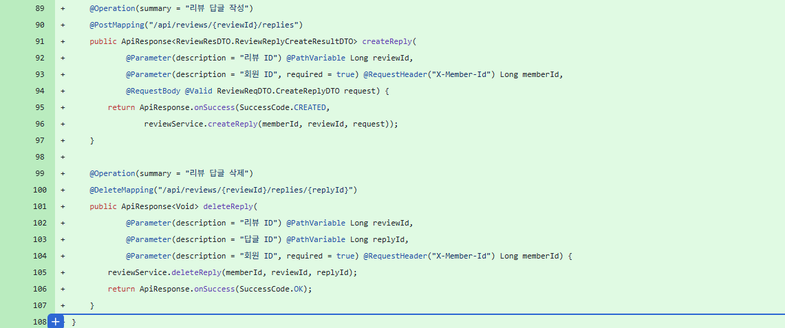
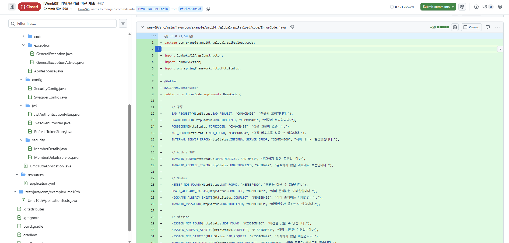

# Chapter10_프로젝트 배포하기 - AWS

## 학습 후기

## 핵심 키워드 정리


### 클라우드 컴퓨팅이란?

클라우드 컴퓨팅이란 셀프 서비스 프로비저닝을 통해 공유 가능한 물리적 또는 가상 리소스 (서버, 스토리지, 애플리케이션) 등 IT 인프라를 임대해 사용하는 방식이다.
즉, 다른 기업의 컴퓨팅 리소스를 우리가 임대해서 사용하는 것이다.

클라우드 서비스가 나오기 전 기업들은 각자 자기만의 서비스를 구축하고 환경설정(온프레미스)을 했다. 
이는 리스크가 너무 크기 때문에 AWS, Google, Microsoft 같은 대기업들이 전 세계 거대한 데이터 센터에 수만 대의 고성능 서버를 미리 지어두고, 원격으로 빌려주는 서비스를 제공한다.

#### 클라우드 컴퓨팅을 사용하는 핵심 이유
1. 속도와 유연성: 마우스 클릭 몇 번이면 새로운 가상 고성능 서버를 개설할 수 있다.
2. 비용 절감: 초기 서버 구축 비용이 들지 않고, 내가 사용한 만큼만 비용을 지불하기 때문에 매우 경제적이다. (학생이나, 스타트업에 필수)
3. 탄력성: 수강신청이나 블랙프라이데이처럼 갑자기 사용자가 몰릴 때, 서버의 스펙을 바로 높이거나, 섭 대수를 여러 대로 늘려 서버가 터지는 것을 막을 수 있다.
   이벤트가 끝나면 다시 줄일 수 있다.

#### 클라우드 서비스의 3가지 형태
- IaaS: 하드웨어만 빌려주는 형태이다. OS(Linux 등) 설치부터 Java 세팅, 서버 가동까지 개발자가 직접 다 해야한다.
    - 이번주차에 공부한 AWS EC2가 대표적인 IaaS이다.
- PaaS: OS, Java runtime 등 개발을 시작할 수 있는 환경(플랫폼)까지 다 세팅해서 빌려주는 형태이다. 개발자는 코드만 짜서 업로드를 하면된다.
    - ex: Heroku, AWS Elastic Beanstalk 등
- SaaS
    - 개발할 필요도 없이 완성된 소프트웨어(서비스) 자체를 웹으로 이용하는 형태이다.
    - ex: 구글 드라이브, Notion, Slack 등


정리하자면, 클라우드 컴퓨팅은 “인터넷을 통해 거대 기업의 서버 자원(CPU, 메모리, DB 등)을 원하는 만큼 원격으로 대여해서 사용하는 기술”을 의미한다.


### AWS? GCP?
클라우드 컴퓨팅이라는 개념을 현실에서 서비스로 제공하는 대표적인 거대 기업 플랫폼들이다.

#### AWS
아마존에서 만든 AWS는 전 세계 클라우드 시장 점유율 1위를 지키고 있는 표준 플랫폼이다.
클라우드 배포를 해봤다고 하면 거의 AWS를 의미한다.

- 장점: 래퍼런스가 전 세계에서 가장 많다. 개발하다가 에러가 나면 구글링이나 스택오버플로우에 검색했을 때 해결책을 구할 수 있다.
- 단점: 서비스 종류가 수백 개가 넘고 UI가 다소 복잡해서 공부해야 할 양이 조금 많다…(진입 장벽도 조금 높아보임,,,,)

#### GCP
구글이 자신들의 초거대 서비스를 운영하던 인프라 기술력을 바탕으로 빠르게 성장한 플랫폼이다.

- 장점: UI/UX가 콘솔 화면처럼 매우 직관적이고 깔끔해서 초보자가 사용하기에는 AWS보다 훨씬 직관적이다. 또한 쿠버네티스의 원조 답게 컨테이너 기반 배포가 매우 강력하다. 빅데이터 분석이나 AI/머신러닝 관련 인프라가 최고 수준으로 구축되어 있다.
- 단점: AWS에 비해서는 전체적인 시장 점유율이 낮다 보니, 특정 에러가 터졌을 때 참고할 수 있는 자료가 상대적으로 AWS보다 적은 편이다.


찾아보니 실무에서는 회사의 비즈니스 성격에 따라 플랫폼을 선택한다고 한다.
일반적인 이커머스나 대규모 트래픽 안정성이 최우선이라면 AWS를 선택하고, AI기반 스타트업이나 빅데이터 기반의 가벼운 컨테이너 배포를 선호한다고 하면 GCP를 선택한다고 한다.

### 환경변수 처리 방법과 왜 환경변수로 민감 정보를 가려야 하는가?
지금까지 프로젝트를 진행할 때 application.yml 파일에 DB 비밀번호나 JWT 시크릿 키를 그대로 적어두는 경우가 많다.
만약 비밀번호와 시크릿 키를 그대로 Github 퍼블릭 저장소에 push한다면…?

- 전 세계 해커들은 프로그램을 돌려 Github에 실시간으로 올라오는 코드 중 password, aws_secret_key, jwt.secret 같은 키워드를 자동으로 수집한다.
  push 버튼을 누르고 단 몇 초 만에 탈취당할 수 있다.
- 실제로 AWS 액세스 키를 코드에 박아두고 Github에 올렸다가, 해커가 키를 훔쳐 고성능 EC2컴퓨터를 수백 대 돌려 수천만원의 비용 폭탄을 맞거나, RDS DB를 통째로 인질로 잡고 비트코인을 요구하는 랜섬웨어 테러를 당하는 사례가 매년 발생한다.

따라서 소스코드에는 절대 비밀값들을 작성하면 안된다. 코드는 껍데기만 두고, 실제 값은 서버 컴퓨터의 메모리(환경변수)에 숨겨두어야 한다.

그럼 환경변수란?
쉽게 말해, 코드가 실행되는 컴퓨터(OS) 시스템 자체에 비밀번호를 임시로 저장해 두는 공간이다.

코드는 실행될 때 OS의 메모리를 보고 동적으로 가져와서 작동하게 된다. 이렇게 하면 소스코드가 전 세계에 공개되어도 실제 비밀번호는 내 컴퓨터(혹은 AWS EC2 서버)에만 저장되어 있으므로 안전하다.

이미 우리는 스프링 부트에서 환경변수를 처리하는 방법에 대해 공부했다.
1. application.yml 코드 수정
   실제 비밀번호를 지우고, 대문자로 된 변수명을 주입한다.
   만약 환경변수가 설정되지 않았을 때를 대비해 콜론(:)뒤에 기본값을 적어둘 수 있다.

``` java
# 안전하고 정석적인 예시
spring:
  datasource:
    password: ${DB_PASSWORD}     # 환경변수 DB_PASSWORD의 값을 가져옴
jwt:
  secret: ${JWT_SECRET_KEY:default_secret_key_for_local} # 없으면 기본값 사용
```

2. 실제 환경에 값 등록
이 코드가 돌아갈 장소에 실제 값을 심어준다.
- 로컬 개발: `Run/Debug Configurations` -> `Modify options` -> `Environment variables` 메뉴에 `DB_PASSWORD=my-secret-1234;JWT_SECRET_KEY=my-jwt-key`를 적어준다.
- Github Actions(CI/CD 빌드 시): `Settings -> Secrets and variables -> Actions`에 암호화된 비밀값으로 등록한 뒤, 빌드 스크립트(`deploy.yml`)에서 넘겨준다.
- 운영 서버 환경: 리눅스 터미널에 `export DB_PASSWORD=my-secret-1234` 명령어로 환경변수를 심어두거나, 배포 시점에 파라미터로 주입한다.

### yml 환경 분리 방법
스프링 부트는 application-{profile}.yml이라는 독특한 파일 이름 규칙을 통해 환경별 설정을 기가 막히게 분리해준다.
기존에 1개만 있던 aaplication.yml 파일을 역할에 따라 총 3개로 쪼갠다.

application-local.yml (로컬 개발용)
보통 내 컴퓨터에서 돌릴 가벼운 설정들을 적어둔다.

``` java
spring:
  datasource:
    url: jdbc:h2:mem:testdb  # 로컬은 가벼운 H2 DB 사용
    driver-class-name: org.h2.Driver
  jpa:
    hibernate:
      ddl-auto: create-drop  # 켰다 켤 때마다 DB 초기화 (테스트 편리)
```

2. application-prod.yml (실제 AWS 운영 서버용)
AWS RDS 주소와 환경변수들을 세팅한다.
``` java
spring:
  datasource:
    url: jdbc:mysql://${RDS_HOSTNAME}:3306/${RDS_DB_NAME} # AWS RDS 주소 연결
    username: ${RDS_USERNAME}
    password: ${RDS_PASSWORD}
  jpa:
    hibernate:
      ddl-auto: validate  #  운영 서버는 절대 DB를 건드리면 안 되므로 검증만한다.
```

3. application.yml (메인 컨트롤)
공통 설정 (포트 번호 등)을 적어두고, 지금 어떤 환경을 기본으로 켤 것인지 결정을 하는 역할을 한다.
``` java
server:
  port: 8080

spring:
  profiles:
    active: local # 기본값은 로컬로 설정. 내 컴퓨터에서 그냥 켜면 로컬로 돌아감
```

이렇게 파일을 분리해 두면, 인텔리제이에서 그냥 실행 버튼을 누르면 기본값인 local 프로필이 활성화되어 H2 DB로 안전하게 켜진다.

하지만 AWS EC2 서버에 올려서 배포할 땐 자바 실행 명령어 뒤에 `-Dspring.profiles.active=prod`라는 옵션을 한 줄 추가해서 실행해준다.
``` java
# AWS EC2 리눅스 터미널에서 서버를 켤 때 치는 명령어
java -jar -Dspring.profiles.active=prod my-project-0.0.1-SNAPSHOT.jar
```

환경분리의 핵심 이점

- 안전성: 로컬에서 개발하다가 실수로 코드나 테스트 데이터를 다 날려도, 실제 운영 DB(prod)는 완벽하게 격리되어 있어 장애 사고를 예방할 수 있다.
- 유지보수성: 환경이 아무리 늘어나도 application-dev.yml 파일을 하나 더 만들면 되기 때문에 확장이 매우 유연하다.


### Docker와 .jar vs Docker 이미지
#### Docker란 무엇인가?
도커를 한 줄로 요약하면 “내 컴퓨터에서 돌리던 환경 그대로를 박스(컨테이너)에 담아서 어느 서버에서든 똑같이 실행할 수 있게 해주는 기술”이다.

과거에는 내 컴퓨터(Window, Mac)에서 잘 돌아가던 스프링 코드가 AWS EC2 서버에만 올리면 “자바 버전이 다르다”, “환경변수 경로가 꼬였다”, “OS 기본 인코딩이 다르다” 등 서버가 뻗는 일이 비일비재했다.

도커는 이 문제를 해결하기 위해 코드, 자바 실행 환경(JDK), OS 설정, 필요한 라이브러리를 ‘컨테이너’라는 규격화된 박스에 통째로 넣었다. 이 박스만 있으면 전 세계 어느 컴퓨터, 어느 서버든 도커만 설치되어 있다면 docker run 명령어 한 줄로 내 컴퓨터와 100% 동일하게 서버를 띄울 수 있다.

#### .jar 배포
빌드된 가벼운 .jar 파일만 AWE EC2 서버로 전송해서 직접 실행하는 방식

- 배포 과정:
1. 내 컴퓨터나 GitHub Actions에서 .\gradlew bootJar를 실행해 .jar 파일을 만든다.
2. 이 파일만 AWS EC2 서버로 업로드 한다.
3. EC2 서버에 직접 Java(JDK)를 설치해야 한다.
4. java -jar app.jar 명령어로 실행한다.
- 장점: 전송하는 파일 크기가 수십 MB 정도로 매우 작고 가볍고, 구조가 단순하다.
- 단점: AWS EC2 서버의 환경에 의존적이다. 만약 EC2 서버의 자바 버전이 내 코드와 다르면 실행되지 않고, 서버 컴퓨터를 교체하거나 대수를 늘릴 때마다 일일이 자바를 다 설치하고 세팅해야 한다.

#### Docker 이미지 배포
.jar 파일에 자바 실행 환경(JDK)과 OS 레이어까지 한 겹 더 감싸서 Docker 이미지라는 하나의 커다란 스냅샷으로 만들어 배포하는 방식이다.

- 배포과정:
1. 프로젝트 루트에 Dockerfile이라는 스크립트를 작성한다. (어떤 자바 버전을 쓸 것인지, 어떤 파일을 넣을지 명시)
2. 이를 빌드하여 Docker 이미지를 생성한다. (.jar에 비해 용량이 수백 MB로 커진다.)
3. 이 이미지를 DockerHub이나 AWS ECR 같은 레포지토리에 PUSH 한다.
4. AWS EC2 서버에는 자바를 깔 필요 없이 오직 Docker만 설치해둔다.
5. EC2에서 docker run {이미지명}을 치면, 도커가 이미지를 다운받아 컨테이너로 서버를 즉시 실행한다.
- 장점: 환경의 완벽한 격리 및 일치. EC2 서버에 자바가 깔려있든 말든 상관이 없다. 도커 박스 안에 이미 완벽하게 자바 환경이 들어있다. 나중에 서버를 더 늘릴 때도 그냥 도커 명령어만 복사해서 붙여넣으면 된다. → 대규모 인프라 관리에 압도적 유리
- 단점: 빌드 시 이미지 용량이 크고, 도커라는 기술을 추가로 학습해야 하므로 초기 세팅이 조금 더 복잡하다.


### 미션
PR 리뷰 대신 지부 내 다른 챌린저의 워크북을 보고 해당 워크북에 담지 않은 내용, 
내가 추가적으로 공부할 내용, 해당 챌린저가 잘한 부분 같은 걸 캡쳐 후 공부 계획, 좋았던 부분, 
아니면 해당 워크북을 작성한 사람 칭찬을 적어주세요!!

저는 키위/윤기화 님의 워크북을 참고하였습니다.

일단 키위님의 가장 기본적인 태도에 대해 배웠던 것 같습니다. 프로젝트를 진행한다면 자신의 실력 역시 중요하지만 
저는 상대방에 대한 배려가 더 중요하다고 생각합니다. 프로젝트의 규모가 커질수록 코드를 상대방에서 설명하거나, 반대로 다른 사람이 짠 코드를
분석하는데 드는 소통 비용이 늘어날 것이라고 생각합니다. 
키위님의 코드를 보면 귀찮더라도 문서화나 어노테이션(@Operation, @Parameter)을 꼼꼼하게 달아주셔서 다른 팀원들이 보기에 더 편하고 시간을 아낄 수 있을 것이라고 생각합니다.



두 번째로 ErrorCode를 살펴보았는데, Common, Auth, Member, Mission 등 서비스의 핵심 도메인별로 완벽하게 분류되어 있습니다.
또한 단순히 HTTP 상태 코드(400, 404등)만 던지는게 아닌 MEMBER400, MISSION400 처럼 동일한 404 상태안에서도 구체적으로 어떤 리소스가 없는지
명확한 코드를 부여하고 있습니다. 이런 부분은 조금 더 배워야 할 것 같습니다.