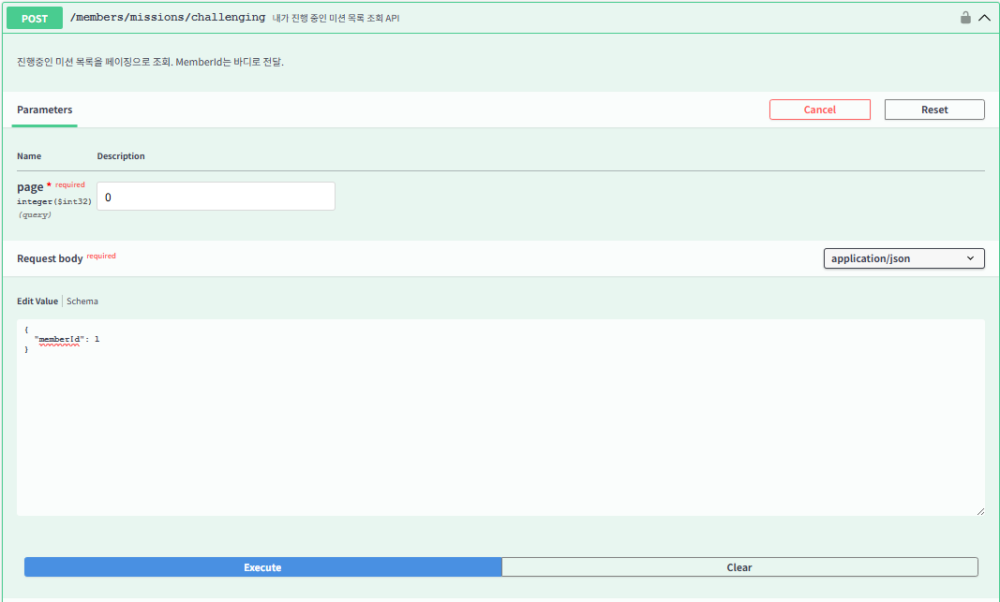
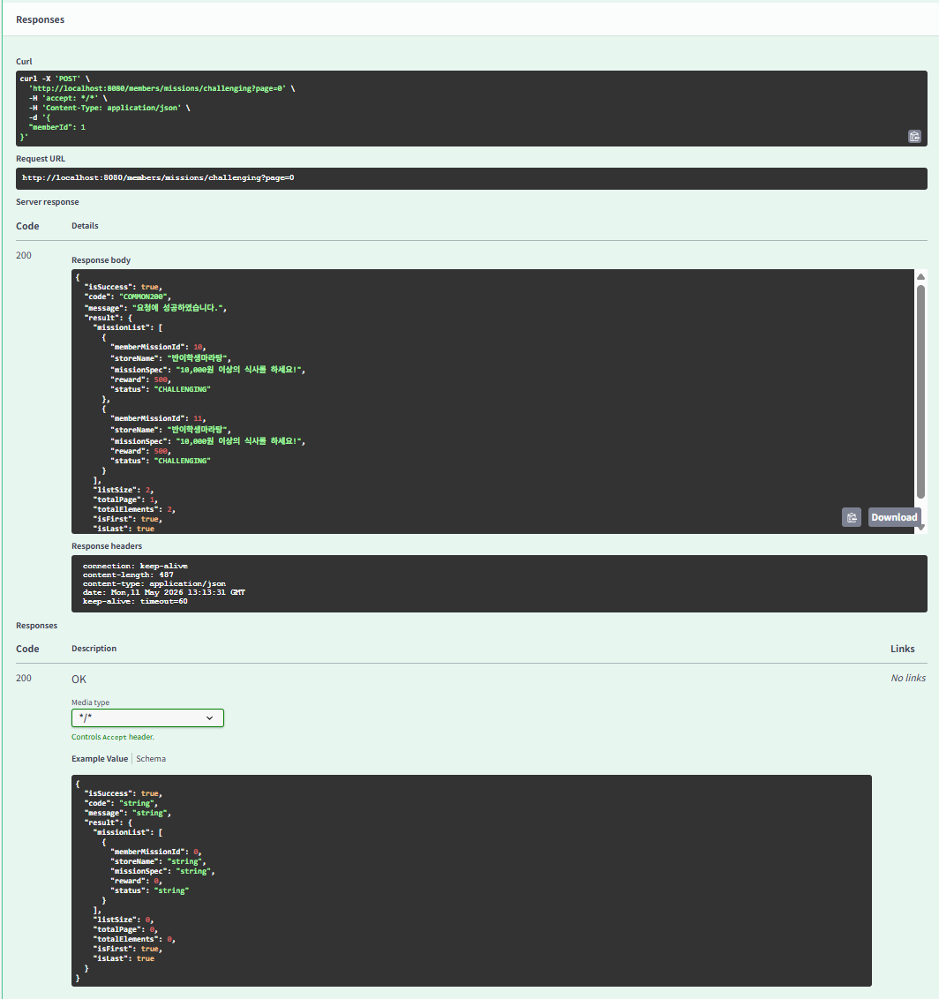
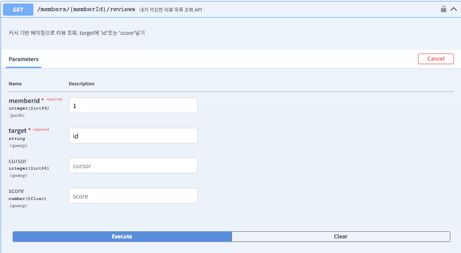
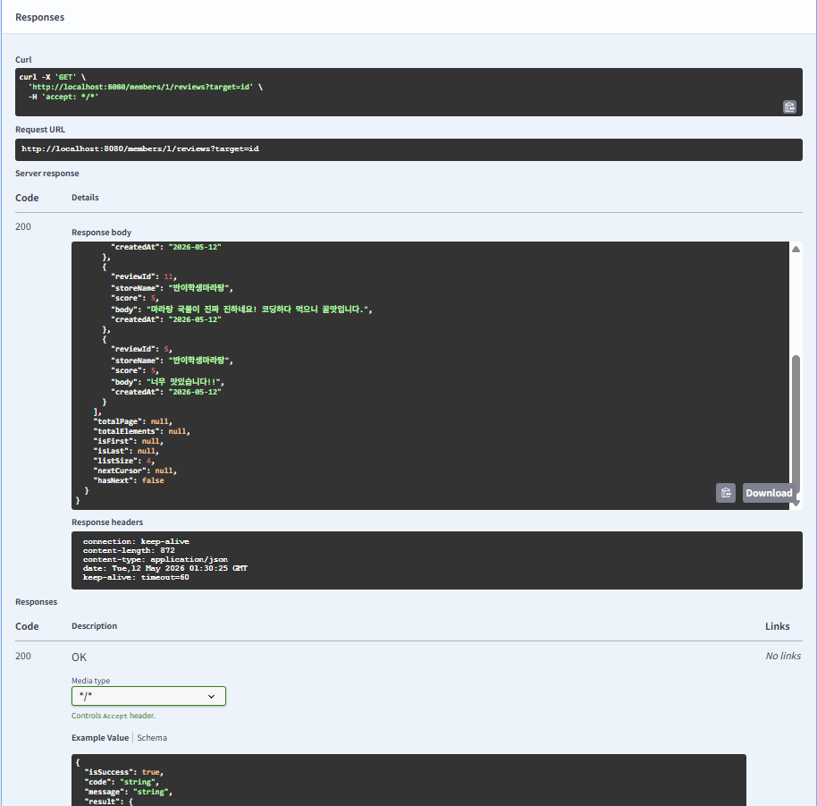
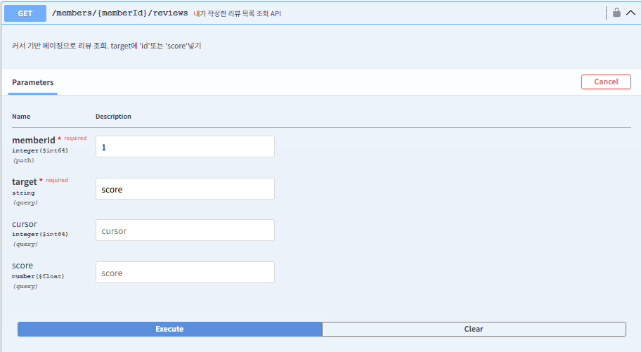
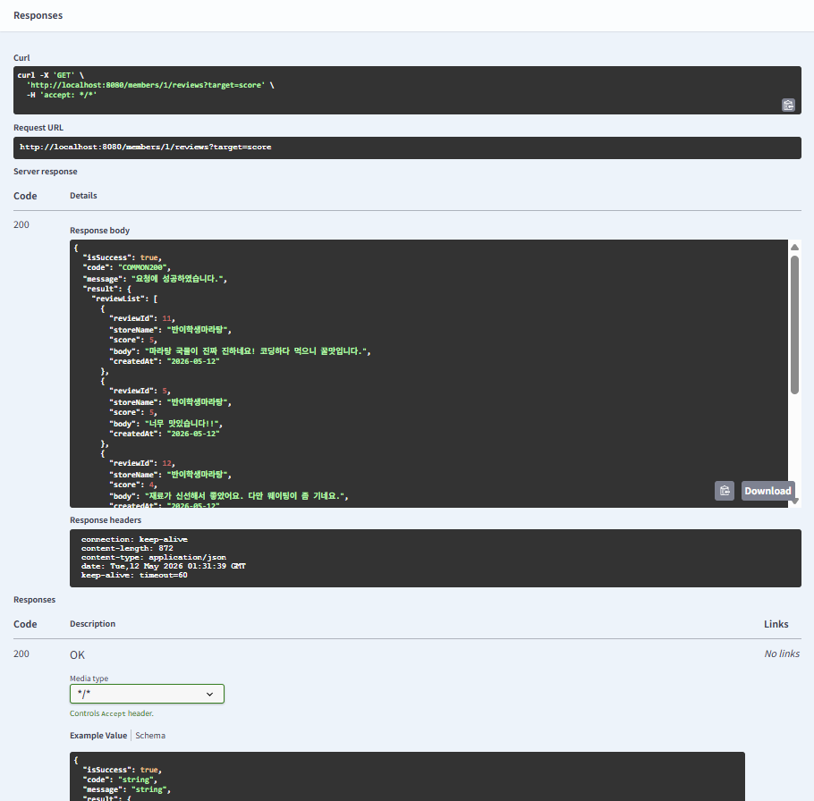

# Chapter07_API 설계 심화 - 페이징
## 학습 후기
## 핵심 키워드 정리

### Page와 Slice

Spring Data JPA는 페이징을 위해 Page와 Slice라는 객체를 제공한다.

Page: 전체 데이터 개수를 함께 조회한다. 게시판처럼 하단에 페이지 번호가 필요한 경우에 사용한다.
Slice: 전체 개수를 조회하지 않고, 다음 페이지가 있는지만 확인하기 위해 설정한 사이즈보다 하나 더 많은 데이터를 조회한다. 무한 스크롤 구현 시 성능 최적화를 위해 사용한다.

#### Page, Slice 장단점
Page 장점:
- 사용자에게 전체 콘텐츠 양을 알려줄 수 있음
- 특정 페이지(ex.4페이지)로 바로 이동하는 기능을 구현하기 쉽다.

Page 단점:
- 성능 부하: 데이터가 수백만 건 이상일 경우, Count 쿼리가 실제 데이터를 가져오는 쿼리보다 훨씬 느려질 수 있다. (DB가 전체를 다 봐야함)

Slice 장점:
- Count 쿼리를 생략하므로 데이터 양이 많아질수록 Page보다 훨씬 빠르다.
- 대량의 데이터를 빠르게 넘겨야 하는 모바일 환경이나 무한 스크롤에 최적화되어 있다.

Slice 단점:
- 사용자가 전체 양이 얼마나 남았는지 알 수 없다.
- 특정 페이지로 건너뛰는 기능이 불가능하다.


#### Page vs Slice 어떤걸 사용해야하는가...?
Page: 전체 데이터 개수를 조회하는 쿼리를 한번 더 실행한다. 따라서 전체 페이지 개수나 데이터 개수가 필요한 경우 유용하다.
Slice: 무한 스크롤 구현에서 사용한다. 무한 스크롤에서는 전체 데이터를 조회할 필요가 없기 때문에 굳이 Page를 써서 쿼리를 불필요하게 날릴 필요가 없다.
차이: 전체 개수를 세느냐(Count 쿼리)


### Java Stream API

#### Stream이란?
데이터의 흐름이다. 배열이나 컬렉션(List, Set등)에 저장된 요소들을 하나씩 참조하여 함수형 인터페이스(람다식)로 처리할 수 있게해주는 기능이다.
특징:
- 원본 데이터를 변경하지 않는다. -> Read-Only
- 한 번 사용한 스트림은 닫히며 재사용이 불가능하다.
- 지연 연산(Lazy Evaluation)을 통해 성능을 최족화한다.


#### Stream 연산의 3단계 구조
1. 생성: 컬렉션이나 배열을 스트림 형태로 만든다. (.stream())
2. 중간 연산: 데이터를 가공한다. 결과값으로 다시 스트림을 반환하기 때문에 체이닝이 가능하다.
- filter(): 조건에 맞는 요소만 추출
- map(): 요소를 다른 형태로 변환 (ex. Entity -> DTO)
- sorted(): 정렬
- distinct(): 중복 제거
3. 최종 연산: 가공된 데이터를 모아서 결과를 낸다. 여기까지 진행이 마무리되면 스트림은 닫힌다.
- collect(): 결과를 List, Set 등으로 수집
- forEach(): 각 요소에 대해 특정 작업 수행
- count(), sum(), average(): 통계 처리

#### Stream API의 장단점
장점:
- 선언적 프로그래밍으로 코드가 간결해지며 가독성이 향상된다.
- parallelStream()을 통해 대량 데이터를 쉽게 병렬 처리할 수 있다.
- 외부 반복(for문) 대신 내부 반복을 사용하여 인덱스 실수 등을 방지한다.

단점:
- 한 줄로 이어지다 보니 중간 단계 에러를 찾기 조금 어려울 수 있다.
- 외부 반복 대신 내부 반복을 사용하여 인덱스 실수를 방지할 수 있다고 했지만, 아주 작은 데이터는 단순 for문이 더 빠를 수 있다.

// List<Review>를 List<ReviewPreViewDTO>로 변환하는 예시코드
``` java
List<ReviewPreViewDTO> reviewPreViewDTOList = reviewList.stream() // 1. 생성
    .map(MemberConverter::toReviewPreViewDTO) // 2. 중간 연산 (변환)
    .collect(Collectors.toList()); // 3. 최종 연산 (수집)
   ```

### 객체 그래프 탐색

#### 개념
정의: 객체지향 프로그래밍에서 참조를 사용하여 연결된 객체들을 따라가며 찾는 것을 의미한다.
JPA에서의 의미: 엔터티 간에 연관관계가 맺어져 있을 때, review.getStore().getName() 처럼 마침표(.)를 찍어서 연관된 엔터티의 정보에 자유롭게 접근하는 것이다.

#### 특징
- 설계를 잘해두면 Review -> Store -> Region 순으로 객체 그래프를 타고 이동할 수 있다.
- 객체 그래프를 탐색할 때 연관된 객체를 실제로 사용하는 시점에 DB에서 조회하는 방식 -> 지연 로딩
- 엔터티를 조회할 때 연관된 객체도 항상 함께 조회하는 방식이다. -> 즉시로딩....


### @Valid vs @Validated
@Valid(자바 표준)
- 주요 용도: 주요 Controller에서 RequestBody나 RequestParam의 유효성을 검사할 때 사용한다.
- 특징:
  - 계층 제한: 기본적으로 컨트롤러 레이어에서만 동작한다.
  - 중첩 검증 가능: 객체 안에 또 다른 객체가 있는 경우, 필드 위에 @Valid를 붙여 중첩 검증을 수행할 수 있다.
  - 에러 발생시 MethodArgumentNotValidException을 던진다.

@Validated (스프링 전용)
- 주요 용도: Service 계층 등급의 유효성 검사나 그룹 검증(Group Validation)이 필요할 때 사용한다.
- 특징:
  - AOP 기반으로 동작하므로 클래스 상단에 @Validated를 붙이면 서비스나 컴포넌트 어디서든 검증이 가능하다 -> 계층이 무관함
  - 상황에 따라 다른 규칙을 적용하고 싶을 때 groups 속성을 사용해서 구분할 수 있다.
  - 에러 발생 시 ConstraintViolationException을 던진다.


## 미션

### 내가 진행중인 미션 조회하기 (오프셋 기반 페이지네이션으로 응답하기, 사용자 ID는 Request Body에서 받기, 하드코딩X)



### 내가 생성한 리뷰들 조회하기 (커서 기반 페이지네이션으로 응답하기, 사진 부분 제외, ID 순, 별점 순 모두 구현하기)





### Request Body가 있는 API에 검증 어노테이션 붙혀 검증하기