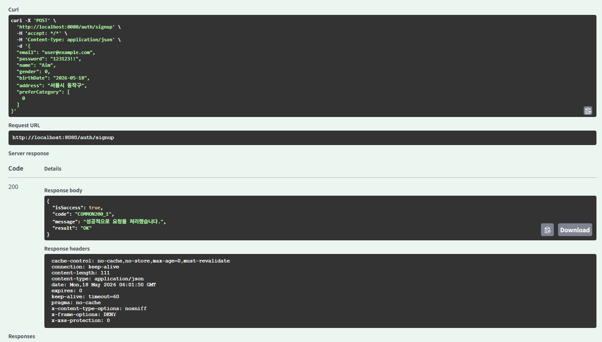
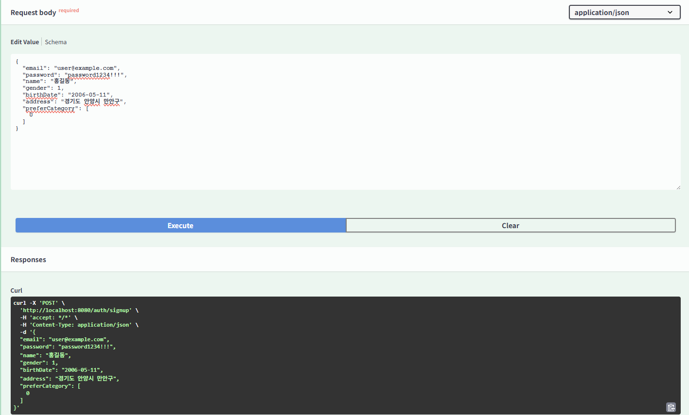
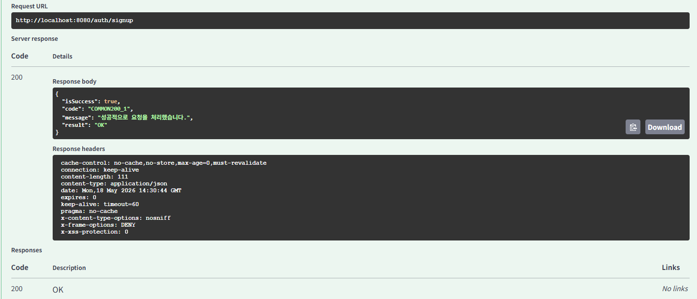
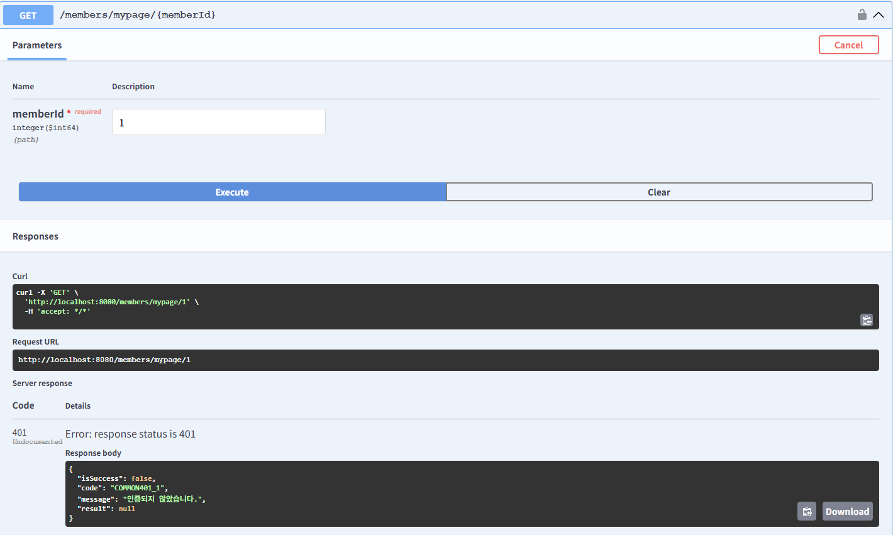

# Chapter08_Spring Security - Security 구조, 폼 로그인 

## 학습 후기

## 핵심 키워드 정리

### Spring Security가 무엇인가?
- Spring Security는 Spring기반 애플리케이션의 보안(인증, 인가, 취약점 방어 등)을 담당하는 스프링 하위 프레임워크이다.
- Spring Security는 인증(Authentication)과 인가(Authorization)에 대한 부분을 Filter의 흐름에 따라 처리를 하고 있다.
  - 서포터 계층 (Filter 기반): Spring Security의 핵심은 수많은 Filter들이 Chain처럼 연결되어 동작한다는 점이다. 
  - 사용자의 요청이 컨트롤러(@RestController)에 도달하기 전, 톰캣과 스피링 사이의 길목을 지키고 먼저 검사해주는 역할을 한다.
- 많은 보안 관련 옵션들을 제공해주어 개발자가 보안 로직을 하나씩 작성하지 않아도 되는 장점이 있다.
  - 보안 표준 제공: 비밀번호 암호화(BCrypt), 세션관리, CSRF 공격 방어 등을 표준화된 고퀄리티 코드로 제공해준다.

### 인증(Authentication) vs 인가(Authorization)

#### 인증(Authentication)
- 사이트에 접속하려는 자가 누구인지 확인하는 절차이다. (사용자가 본인인지 확인)
- Ex: 로그인 창에 아이디와 패스워드를 쳐서 내가 “test@gmail.com”임을 증명하는 행위.
- 실패 시 AuthenticationEntryPoint가 출동하여 401 Unauthorized 처리

#### 인가(Authorization)
- 사용자가 어떤 일을 할 수 있는지 권한(Role)을 설정하는 절차이다.
- 특정 페이지, 리소스에 접근할 수 있는지 권한을 판단한다.
- Ex: 일반 회원(USER)이 관리자 페이지(ADMIN)에 접속하려고 할 때 막아서는 행위
- 실패시 AccessDeniedHandler가 403 Forbidden 처리

인증이 통과되어야 인가를 따질 수 있다.

### Stateful vs Stateless

#### Stateful와 Stateless의 차이점
서버가 사용자의 상태(state, 즉 로그인 정보 등)를 기억하고 있느냐, 아니냐에 대한 아키텍처 방식의 차이.

1. Stateful(상태유지방식) → 세션/쿠키 방식

#### 개념
클라이언트와 서버 관계에서 서버가 클라이언트의 상태를 보존함(자신의 메모리나 DB에 간직)을 의미한다. 즉, 서버에서 클라이언트가 이전 단계에서 제공한 값을 저장하고 다음 단계에서도 저장한 상태이다.
클라이언트의 정보를 기억한다는 말은 어딘가에 정보를 저장하고 통신할 때마다 읽는다는 뜻 → 일반적으로 쿠키(Cookie)에 저장되거나, 서버의 세션(Session) 메모리에 저장되어 상태를 유지한다.

#### 동작
유저가 로그인을 성공하면 서버는 세션 장바구니에 유저 정보를 넣고 방 번호를 브라우저에 준다. 브라우저는 다음 요청부터 이 방 번호 열쇠를 들고오고, 서버는 메모리를 뒤져 알아챈다.

Ex: 홈페이지에서 한 번 로그인을 하면 페이지를 이동해도 로그인이 풀리지 않고 계속 유지되는 것.

대표적인 Stateful 구조: TCP의 3-Way-handshaking과정

#### Stateful 장단점
- 유저 관리가 직관적이고 안전하다.
- 유저가 수만 명으로 늘어나면 서버 메모리가 터지거나, 분산 서버로 늘릴 때 세션 공유가 까다로워진다.
- 해당 서버가 멈추거나 여러 이유로 해당 서버를 못쓰게 되어 다른 서버를 사용해야 할 때 발생 → 새로운 서버에서는 이전 서버에서 가지고 있던 상태값들을 가지고 있지 않기 때문

2. Stateless(무상태 방식) → 다음주차에서 배울 JWT방식

#### 개념   
클라이언트와 서버 관계에서 서버가 클라이언트의 상태를 보존하지 않음을 의미한다.
서버는 단순히 요청이 오면 응답을 보내는 역할만 수행하며, 상태 관리는 전적으로 클라이언트에게 책임이 있다. 즉, 통신에 필요한 모든 상태 정보들은 클라이언트에서 가지고 있다가 서버와 통신할 때 데이터를 실어 보내는 것이 무상태 구조이다.

#### 동작
유저가 로그인하면 서버는 상태를 저장하는 대신, 유저 정보가 담긴 위조 불가능한 증명서(JWT 토큰)를 유저에게 던져주고 뒤로 돌아선다. 유저는 매 요청마다 이 토큰 증명서를 보낸다. 서버는 검사를 할 때 그 토큰이 진짜인지 위조인지 체크만 하고 진짜면 통과시켜준다.

대표적인 Stateless 프로토콜: UDP, HTTP
무상태에서는 브라우저는 데이터를 전송할 때마다 연결하고 바로 끊어버리게 된다.

#### Stateless 장점
- Stateful과 달리 서버가 바뀌아도 정확한 응답에 문제가 없기에 대량의 트래픽 발생 시에도 서버 확장을 통해 대처가 가능하다.

### 미션
1. Spring Security를 적용하고 회원가입 API를 구현해주세요.
(폼 로그인을 위한 email, password를 추가로 받고 비밀번호는 BCrypt로 솔트처리해주세요)

2. 회원가입 API는 Public API, 그 이외의 API는 Private API로 설정해주세요
Public API: 로그인 불필요 / Private API: 로그인 필요)
(exceptionHandling을 구현해 인증, 인가 실패 시 응답이 통일되야 함)

