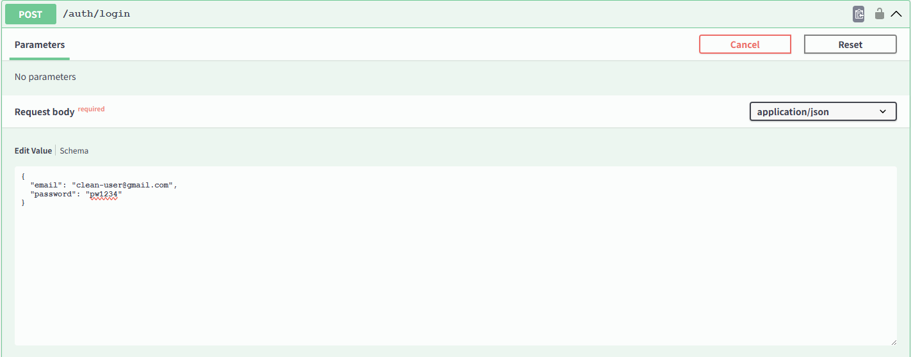
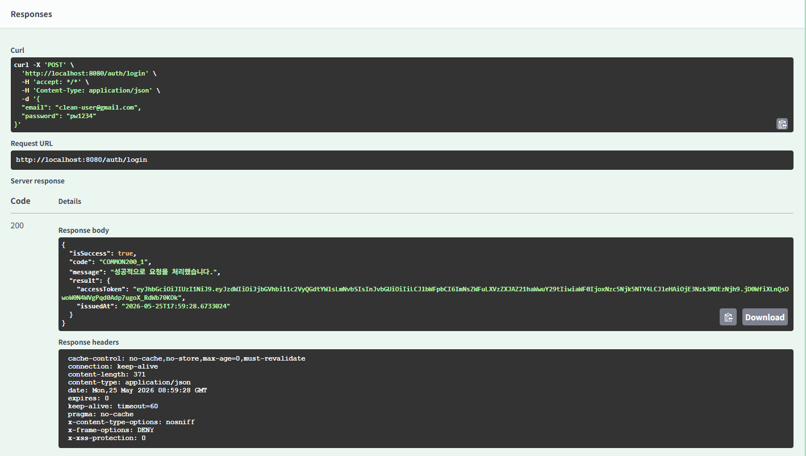
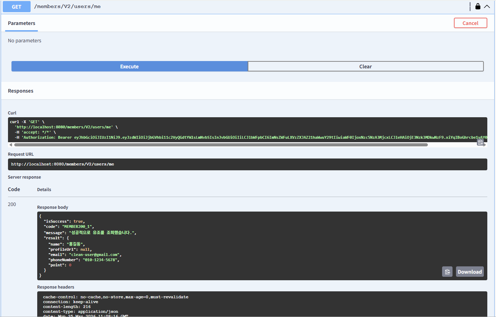
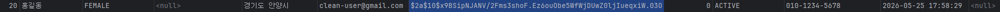

# Chapter09_Spring Security - JWT, OAuth

## 학습 후기

## 핵심 키워드 정리

### 세션과 토큰의 차이는?

#### 세션 기반 인증
: 유저의 로그인 상태를 서버(Memory/DB)에 저장해두고, 클라이언트에게는 저장소 열쇠인 Session ID를 전달해주는 방식 (Stateful - 상태 유지)
    - 인증 정보 저장: 서버 (메모리, Redis, DB 등)
    - 서버 상태 유지 여부: Stateful (유저 수만큼 서버 메모리 차지)
    - 통신 시 보내는 값: Session ID (의미 없는 문자열 난수)
    - 서버 검증 방식: DB나 Memory에서 해당 ID가 있는지 조회
    - 강제 로그아웃 조치: 서버에서 세션을 날리면 가능하다.
    - 확장성: 분산 서버 환경에서 세션 공유 설정이 필요하다. (까다로움…)

#### 토큰 기반 인증
: 유저의 로그인 상태를 토큰 (JWT) 안에 직접 다 넣어서 클라이언트가 들고 다니게 하는 방식(Stateless - 무상태)
    - 인증 정보 저장: 클라이언트 (브라우저 스토리지, 모바일 기기)
    - 서버 상태 유지 여부: Stateless (서버는 토큰을 저장하지 않음)
    - 통신 시 보내는 값: JWT (유저 정보 + 시그니처가 담긴 문자열)
    - 서버의 검증 방식: 비밀키(Security Key)를 이용해 수학적 검증
    - 상제 로그아웃 조치: 기본적으로 불가능 (만료 전까지 토큰은 유효함)
    - 확장성: 어떤 서버든 비밀키만 알면 되기 때문에 확장성이 좋다.

#### 세션, 토큰 기반 인증 장단점

1. 세션 기반 인증
    - 장점: 보안 통제력
        - 서버가 인증 정보의 절대적인 주도권을 쥐고 있다. 
        - 만약 토큰이 탈취당하거나 해킹 위험이 감지되면, 서버에서 해당 세션을 강제로 파기하여 즉시 로그아웃 시킬 수 있어 보안 통제력이 매우 뛰어나다.
    - 단점: 서버 부하 + 확장성 한계
        - 유저가 늘어날 때마다 서버 메모리를 동적으로 잡아먹기 때문에 동시 접속자가 많아지면 서버가 과부하로 터질 수 있다.
        - 서버를 여러 대 두는 대규모 서비스(스케일 아웃) 환경에서는 만약 1번 서버에 로그인 한 유저가 2번 서버로 요청을 보냈을 때 로그인 정보가 없는 현상이 발생하고, 
        - 이를 맞추기 위해 Redis 같은 별도의 세션 서버를 구축해야 하는 비용과 복잡성이 생길 수 있다.

2. 토큰 기반 인증
   - 장점: 무한한 확장성과 가벼움
       - 서버가 유저의 상태를 전혀 보관하고 있지 않기 때문에 서버 메모리가 조금은 넉넉?하다. 서버가 1000대로 늘어나도 동일한 Secret Key를 가지고 있으면 어떤 서버에서든 즉시 검증이 가능하므로 무한한 확장성을 가진다.
       - 웹뿐만 아니라 모바일 앱, 그리고 다른 서비스와의 API 연동 환경애서도 표준화된 방식으로 쉽게 인증을 처리할 수 있다.
   - 단점: 취약한 사후 대처
       - 이미 발급된 토큰은 서버가 강제로 회수하거나 만료시킬 방법이 없다. 토큰을 해커가 훔쳐가더라도 만료 시간이 끝날 때까지 무조건 문을 열어줘야 하기때문에, 이를 보완하기 위해 Access/Refresh Token 이원화 전략이 필수로 요구된다.
       - 토큰 안에 유저 정보를 담다 보니 세션 ID에 비해 문자열이 길어져서, 요청이 많아지면 네트워크 대역폭(데이터 전송량) 낭비가 생길 수 있다.      

### 세션과 토큰의 차이는?

(이해를 하기 위해 조금 쉽게 놀이공원에 예시를 들어서 생각을 해보았다.)

#### Access Token (자유이용권 팔찌)
- 놀이공원에서 바이킹을 틸 때마다 입구에서 직원에게 보여주는 출입증이다.
- 이 자유이용권이 만약 1시간권 이라면 보안(분실 위험)을 위해 ‘당일  한 시간 까지만 유효 ’라는 글이 써 있을 것이다. 한 시간이 지나면 이 자유이용권은 쓰레기 조각이 된다.

#### Refresh Token (영수증이나 신분증)
- 한 시간권이 끝나고 더 놀고 싶다면 매표소로 다시 돌아가야 해서 짜증이 날 수 있다.
- 이때 숨겨둔 영수증(Refresh Token)을 찍으면, 새 1시간짜리 이용권(Access Token)이 발급이 된다.
- 이 영수증은 평소 놀이기구를 탈 때는 꺼내지 않고, 숨겨둔다.

#### 왜 이 두 토큰을 분리해서 사용하는지 생각을 해보자.
만약 토큰을 하나만 사용하고 만료 시간을 3일로 주면 네트워크 통신을 할 때마다 토큰이 왔다 갔다 하다가 해커에게 중간에 가로채지면 
해커는 3일동안 이 계정으로 온갖 짓을 다 할 수 있다.
이를 방지하기 위해 이원화 시스템을 구축하면 방어가 가능하다. 

- Access Token으로 만료기한을 30분으로 설정하면 해커가 훔쳐가더라도 30분 뒤면 쓸모가 없어진다.
- Refresh Token은 수명을 2주로 설정하면 수명이 2주로 길지만, 평소 API 요청을 할 때는 절대 네트워크 세상 밖으로 돌아다니지 않는다. 30분에 한 번씩 토큰 갱신을 할 때만 잠깐 ㅌ통신 하기 때문에 해커가 가로챌 기회가 거의 없다.

#### 그럼 어디에 보관을 해야하는지 생각을 해보자.

- Access Token
    - 서버는 이 토큰을 디비나 메모리에 전혀 저장하지 않는다.
    - 클라이언트가 헤더에 실어 보내면, 서버는 가지고 있는 Secret Key를 이용해 수학적 연산만 하고 바로 통과시킨다. 그래서 처리 속도가 빠르다.

- Refresh Token:
    - Refresh Token 만큼은 백엔드 서버가 DB나 Redis에 유저 ID와 매핑해서 저장해둔다.
    - 그 이유는 강제 로그아웃(차단) 기능을 구현하기 위해서이다.
    - 만약 유저의 스마트폰이 분실되었다면, 서버는 저장소에 있는 유저의 Refresh Token을 강제로 지워버린다. 그러면 해커는 아무리 만료된 Access Token을 들고 와서 갱신을 요청해도, 서버가 저장소를 보고 거절해 버릴 수 있다.

#### OAuth 1.0과 OAuth 2.0의 차이는?

OAuth 1.0은 웹 브라우저 환경만을 타깃으로 만들어졌기 때문에 역할 분담이 간단했다. 반면 2.0은 현대의 다양한 
클라이언트 환경(모바일 앱, Single Page Application 등)을 지원하기 위해 서버의 역할을 쪼갰다.

##### 1. 인증 흐름과 이키텍처의 분리 (구조차이)
- OAuth 1.0: 토큰을 발급해 주는 서버와 실제 데이터(리소스)를 가지고 있는 서버가 한 덩어리로 묶어야 했다.
- OAuth 2.0: 인증 서버(Authorization Server)와 리소스 서버(Resource Server)가 완전히 분리될 수 있도록 설계되었다.
  덕분에 대규모 시스템에서 인증 레이어만 따로 분리해 마이크로서비스로 관리하기가 훨씬수월해졌다.

##### 2. 암호화 방식

- OAuth 1.0
  - HTTPS가 필수가 아니던 시절에 나왔기 때문에, 모든 API 요청마다 HmacSHA1 같은 복잡한 암호화 알고리즘을 사용해
    디지털 서명(Signature)을 생성하고 헤더에 실어 보내야 했다.
  - 개발자가 직접 인코딩 규칙, 정렬 규칙을 맞춰 매번 서명을 구워야 했기 때문에 구현 난이도가 최상...

- OAuth 2.0
  - 암호화 책임을 통신 계층인 HTTPS에 전적으로 위임한다. 통신 채널 자체가 암호화되어 있으니 토큰을 복잡하게 꼬지 않고 그냥 보낸다.
  - 미션1에서 테스트를 진행할 때 헤더에 넣었던 Authorization: Bearer [token] 방식이 OAuth 2.0 표준 규격이다.
    서명을 만들 필요가 없어 생산성이 Good.

##### 3. 토큰의 수명

- OAuth 1.0: 토큰의 만료 기간이 아예 없거나, 한 번 발급받으면 수명이 매우 길었다. 만약 토큰이 탈취당하면 보안상 치명적이었다.

- OAuth 2.0: 토큰의 수명을 짧게 제한하는 대신, Access Token과 Refresh Token의 개념을 도입함.
             미션1을 진행할 때 시간이 오래 걸려 토큰 만료가 되었는데, 토큰 만료 현상을 해결하기 위해 뒤에서 새 토큰을 받아오는 Refresh Token 체계를 표준화 하였다.

### 미션 1
JWT 토큰 방식의 회원가입, 로그인 구현하고 마이페이지도 워크북과 같은 형식으로 개선하기
(Swagger에서 테스트하는 사진 & DB에 저장되는 사진 필수!)

