# Chapter09 미션 제출

**Name:** 리온/최형석  
**Mission:** Chapter09

---

# 1. 9주차 워크북 학습 후기

> JWT 토큰을 사용하는 방식이 실무에서 많이 쓰이는 이유를 느낀 것 같습니다. 또 직접 카카오 개발자 플랫폼을 통해 OAuth 를 구현해보니 사소한 속성 하나라도 놓치면 오류가 날 때 고치기 힘들다는 걸 다시 한 번 느낀 것 같습니다. 

---

# 2. 핵심 키워드 정리

## 세션(Session)과 토큰(Token)

> 사용자 인증 상태를 관리하는 두 가지 방식

---

### 세션 기반 인증

- 서버가 로그인 상태를 저장
- 클라이언트는 세션 ID만 전달

```java
request.getSession().setAttribute("memberId",member.getId());
```

→ 서버 메모리(세션)에 로그인 정보 저장

---

### 특징

- 서버가 사용자 상태 관리
- 보안성이 비교적 높음
- 서버 확장 시 세션 관리 필요

---

### 토큰 기반 인증 (JWT)

- 서버가 토큰 발급
- 클라이언트가 토큰 직접 보관

```java
String token = jwtProvider.createAccessToken(memberId);
```

→ 요청마다 토큰 전달

---

### 특징

- Stateless 방식
- 서버가 로그인 상태 저장 안함
- 모바일/API 서버에 적합

---

### 세션 vs 토큰

| **구분** | **세션** | **토큰** |
| --- | --- | --- |
| 인증 정보 저장 | 서버 | 클라이언트 |
| 서버 상태 관리 | Stateful | Stateless |
| 확장성 | 낮음 | 높음 |
| 사용 예시 | 전통 웹 | REST API |

→ 스프링 부트 API 서버에서는 JWT 방식 많이 사용

---

## Access Token과 Refresh Token

> JWT 인증에서 사용하는 두 종류의 토큰

---

### Access Token

- 실제 인증에 사용하는 토큰
- 유효 시간이 짧음

```java
String accessToken = jwtProvider.createAccessToken(memberId);
```

→ API 요청 시 사용

---

### 특징

- 인증 정보 포함
- 만료 시간이 짧음
- 탈취 위험 대비

---

### Refresh Token

- Access Token 재발급용 토큰
- 유효 시간이 길음

```java
String refreshToken = jwtProvider.createRefreshToken(memberId);
```

→ Access Token 만료 시 사용

---

### 특징

- 재로그인 없이 토큰 재발급 가능
- 보통 DB 또는 Redis에 저장

---

### Access vs Refresh

| **구분** | **Access Token** | **Refresh Token** |
| --- | --- | --- |
| 역할 | 인증 | 재발급 |
| 사용 빈도 | 많음 | 적음 |
| 만료 시간 | 짧음 | 김 |
| 탈취 위험 | 높음 | 상대적으로 낮음 |

→ 보안을 위해 두 토큰을 함께 사용

---

## OAuth 1.0 vs OAuth 2.0

> 외부 서비스 로그인 인증 방식의 발전 과정

---

### OAuth 1.0

- 요청마다 서명(Signature) 필요
- 구현 복잡

```java
Authorization: OAuth oauth_signature="..."
```

→ 보안은 강하지만 사용 어려움

---

### 특징

- 암호화 서명 사용
- 구현 난이도 높음
- 현재 거의 사용 안함

---

### OAuth 2.0

- Access Token 기반 인증
- HTTPS 사용 전제

```java
Authorization: Bearer access_token
```

→ 현재 대부분 서비스가 사용

---

### 특징

- 구현 단순화
- 모바일/웹 환경 최적화
- Google, Kakao, Naver 로그인 등에 사용

---

### OAuth 1.0 vs 2.0

| **구분** | **OAuth 1.0** | **OAuth 2.0** |
| --- | --- | --- |
| 인증 방식 | 서명(Signature) | Access Token |
| 구현 난이도 | 높음 | 낮음 |
| 보안 방식 | 자체 서명 | HTTPS 기반 |
| 현재 사용 | 거의 없음 | 대부분 사용 |

→ 스프링 부트 소셜 로그인에서는 OAuth 2.0 사용

---

# 3. 미션 기록

## JWT 토큰 방식 적용

### JWT 토큰 방식 적용 후 회원가입 진행

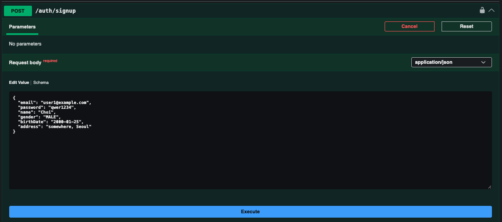
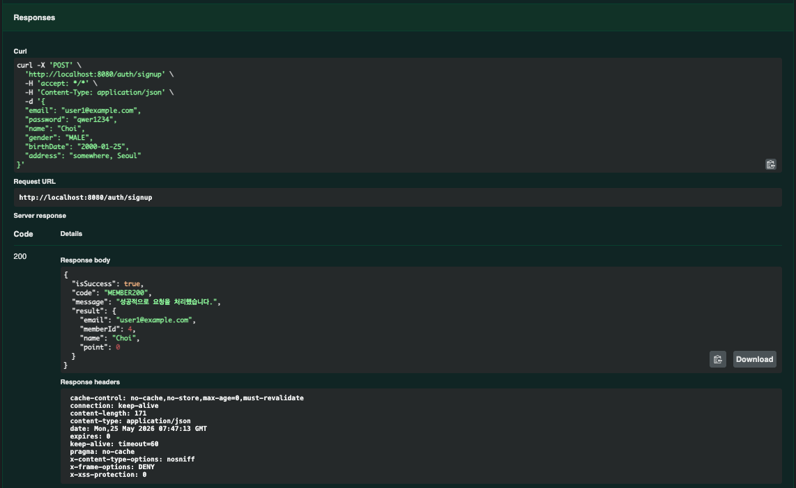

DB 결과


### 로그인

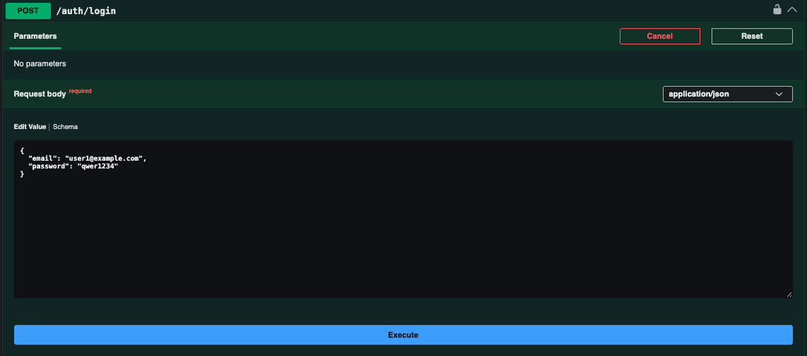

클라이언트에서 accessToken 받음

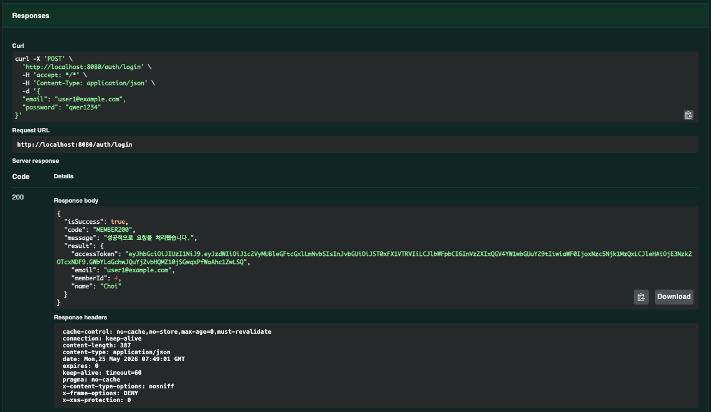

Swagger 에서 Authorize

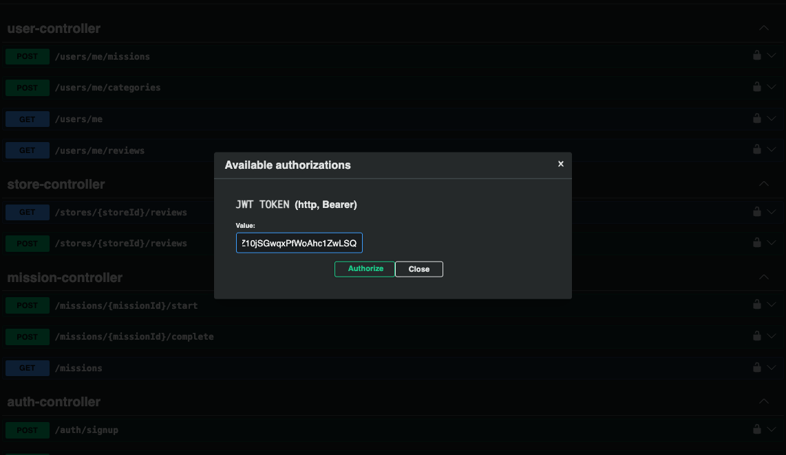
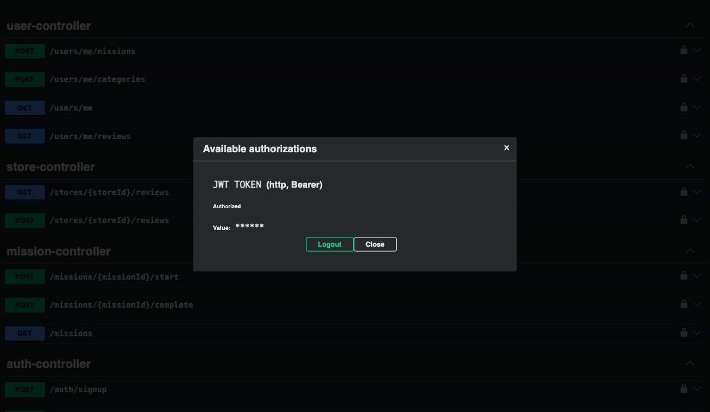

### 마이페이지 조회

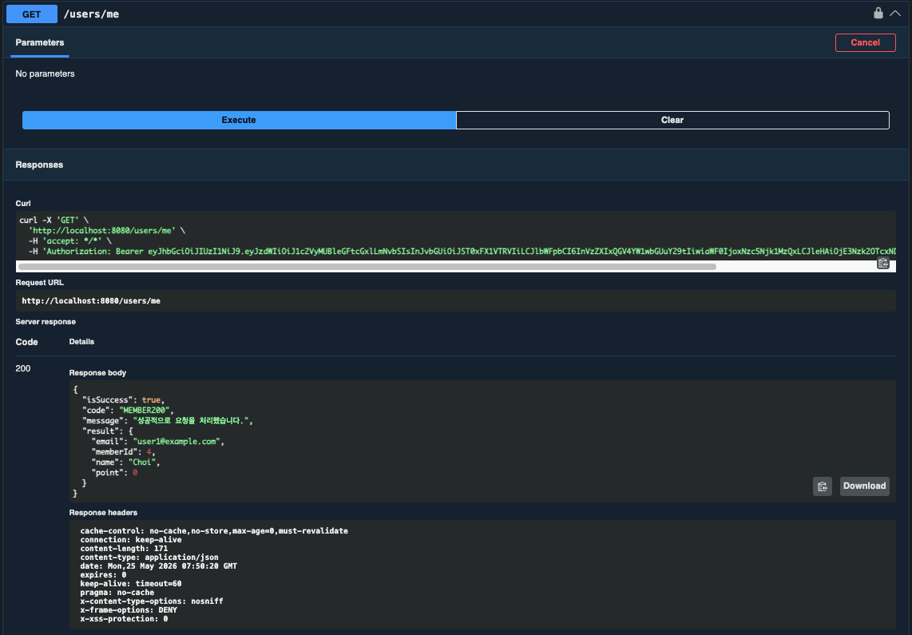

---

## OAuth 구현

카카오 개발자에서 앱 필수 설정 및 스프링 애플리케이션 설정 진행

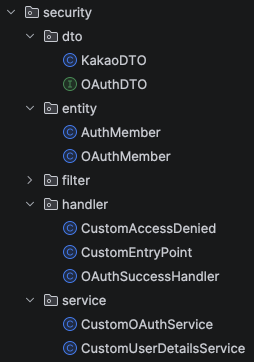

OAuth 인증 과정에 필요한 DTO, UserDetails 구현체, 핸들러, 서비스 구현

### 테스트

http://localhost:8080/oauth2/authorization/kakao 접속 및 카카오 계정으로 로그인 후 약관 동의

응답 (accessToken)

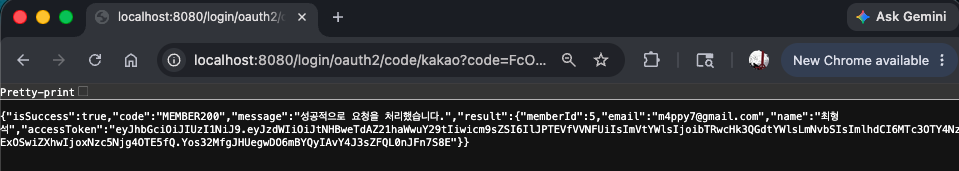

DB 결과

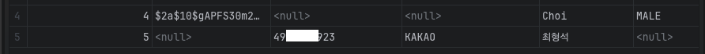
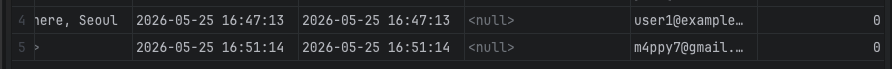
