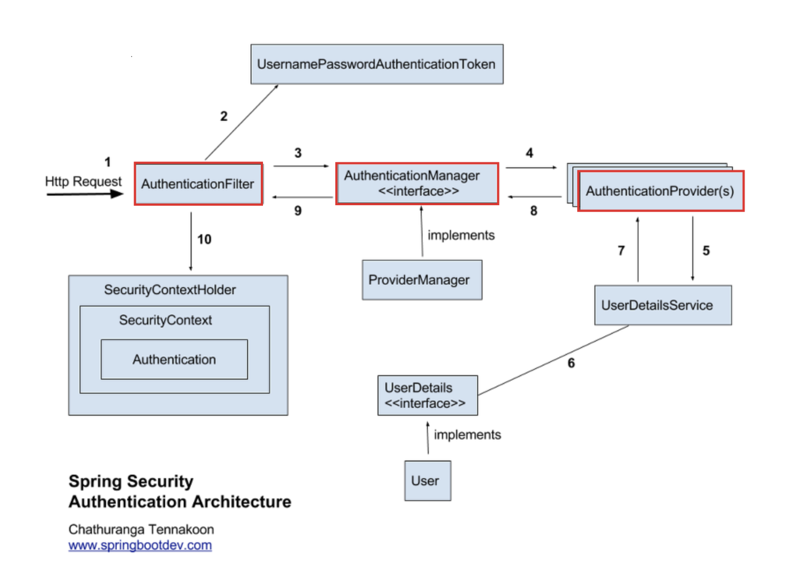

### 핵심 키워드
#### 1. Spring Security가 무엇인가?
- 스프링 기반 어플리케이션 보안을 담당하는 스프링 하위 프레임워크
- 보안에 관련해서 많은 옵션을 제공해주기 때문에 개발자가 보안 관련 로직을 따로 작성하지 않아도 됨.

1. 유저의 로그인 요청이 필터에 도착
2. 요청에서 ID/PW를 꺼내 인증용 토큰 객체 생성
3. 만든 토큰을 인증 토큰을 AuthenticaionManager에 넘겨서 인증 요청
4. AuthenticaionManager가 인증을 AuthenticaionProvider에 위임
5. AuthenticaionProvider가 유저 조회를 위해 UserDetailsService 호출
6. DB에서 유저를 찾아 UserDetails객체로 반환 
7. 조회된 유저가 AuthenticaionProvider로 반환
8. 입력된 PW와 DB PW를 BCrypt로 비교 후 AuthenticaionManager로 반환
9. 인증 결과를 AuthenticaionFilter로 반환
10. 인증 성공 시 SecurityContextHolder 안의 SecurityContext에 Authentication 저장
11. 성공 -> AuthenticationSuccessHandler 호출 / 실패 -> AuthenticationFailureHandler 호출 (401 Unauthorized)

#### 2. 인증(Authentication)vs 인가(Authorization)
**인증**
- 사용자의 신원이 실제와 일치하는지 검증하는 절차 (신원 확인)
웹 환경에서의 인증 요소
- 지식 기반 : 사용자가 알고 있는 지식 (ex : PW, PIN번호, 보안 질문) 
- 소유 기반 : 사용자가 소유하는 것 (ex : 보안카드, 공동인증서)
- 생체 기반 : 사용자의 신체적 특성 (ex : 안면인식, 홍채인식, 지문인식)

**인가**
- 인증된 사용자가 특정 리소스에 접근하거나 이용 할 수 있는지 확인하는 절차
웹 환경에서의 인가 예시
- 유튜브에서 다른 사람의 영상을 조회(재생)은 되지만 삭제는 불가능
- 사이버강의에서 내가 수강한 과목 외의 과목을 수강 불가능

**에러 코드의 차이**

| 분류 항목 | 401 Unauthorized (인증 실패) | 403 Forbidden (인가 실패) |
|---|---|---|
| HTTP 상태 코드 | 401 | 403 |
| 영문 명칭 | Unauthorized (미인증) | Forbidden (금지됨) |
| 핵심 개념 | 인증 (Authentication) | 인가 (Authorization) |
| 상태 설명 | 클라이언트가 누구인지 아직 신원 확인이 안 된 상태 | 클라이언트의 신원은 확인되었으나, 해당 리소스에 접근할 권한이 없는 상태 |

#### 3. Stateful vs Stateless
Stateful (상태유지)
- 서버가 클라이언트의 상태를 보존하는 것
- 클라이언트의 다음 요청이 이전 요청 관계가 이어지는 것이다.
- 대표적으로 TCP 통신은 3-way-handshake를 통해 연결되며 서버가 클라이언트의 세션 정보를 저장한다.

Stateless (상태 비저장)
- 서버가 클라이언트의 상태를 보존하지 않는 것
- 클라이언트의 모든 요청이 독립적이다.
- 대표적으로 단방향으로 데이터를 전송하는 UDP 프로토콜 방식이 있다.

### 미션
