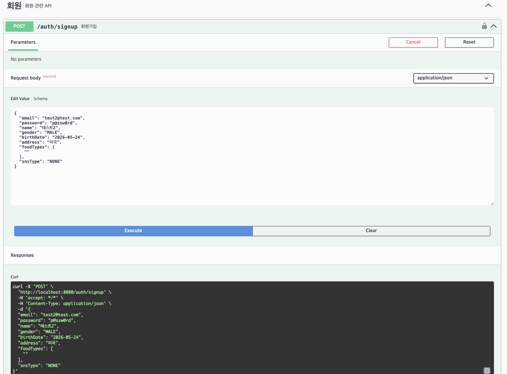
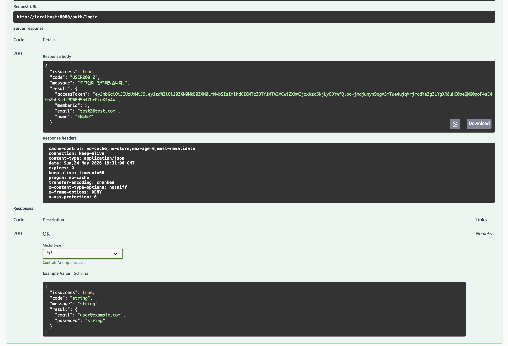
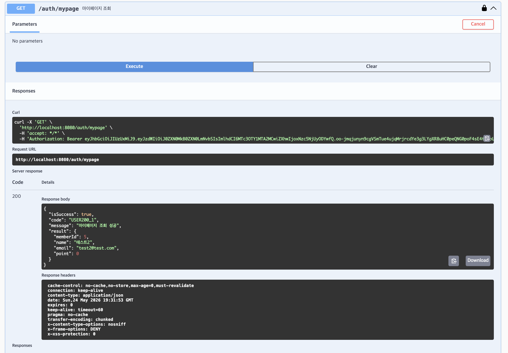
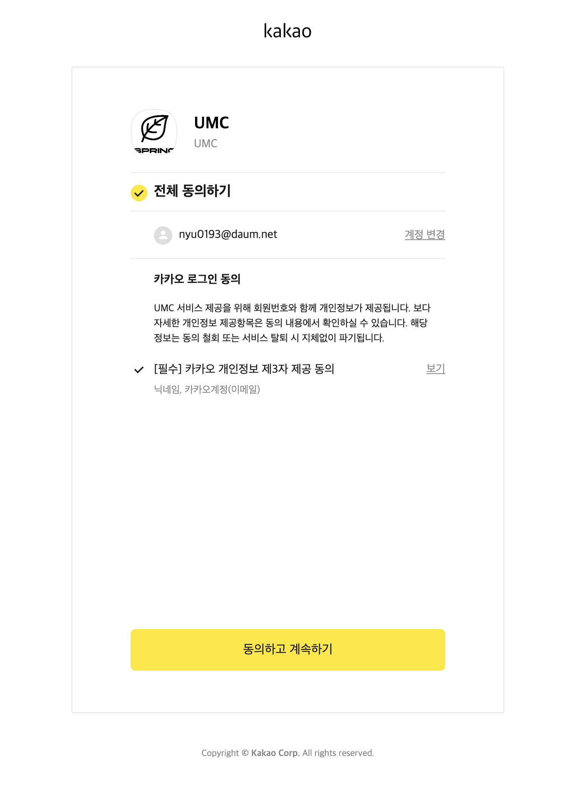
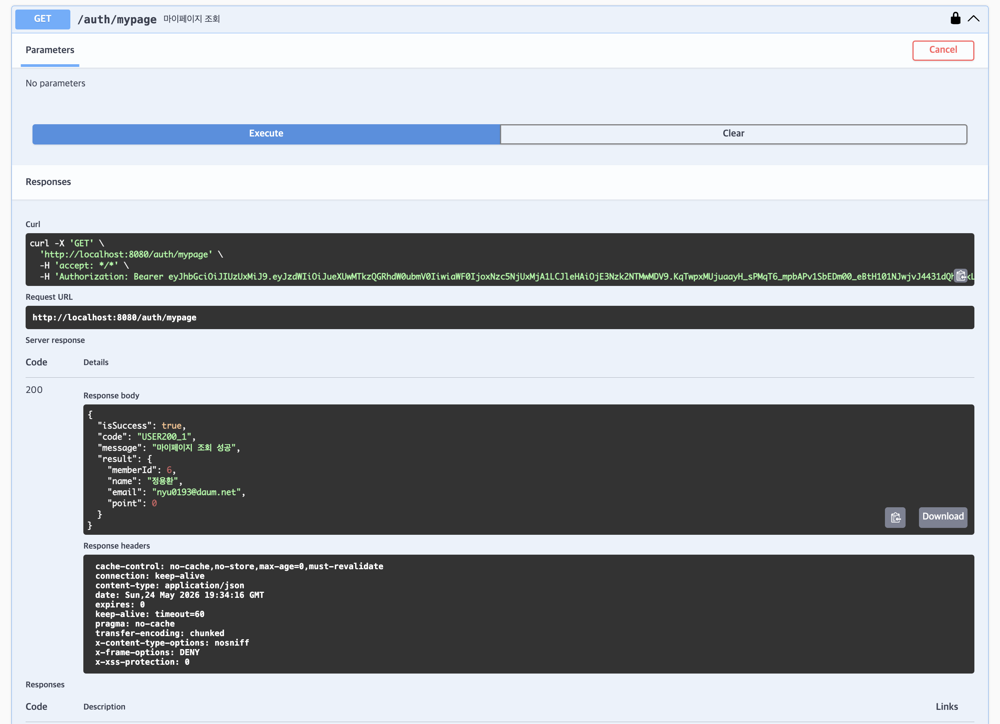
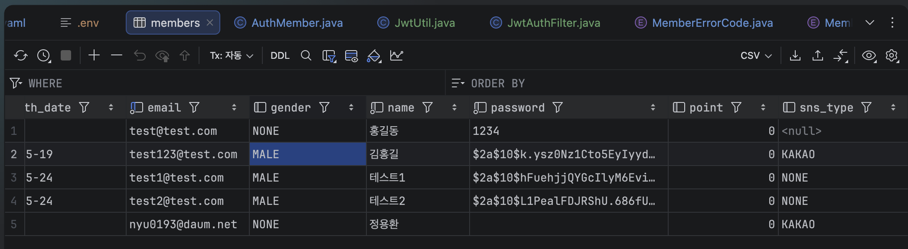

### 키워드 정리

#### 세션과 토큰의 차이는?
세션
- stateful한 방식 (http의 stateless한 특성을 위배하게됨)
- 로그인 시 세션 ID를 발급하여 쿠키로 전달, 인증 정보는 서버에 저장
- 다음 요청이 올 때마다 쿠키에 있는 세션ID의 유효성을 검사
- 서버가 여러 대로 늘어나면 각 서버가 세션을 공유해야 하고, 세션의 양이 많아질수록 서버의 부담이 증가한다.

토큰
- stateless한 방식
- 인증에 필요한 정보들을 암호화시킨 방식
- 헤더(header).내용(payload).서명(signature) 으로 된 구조로 되어있다
- 토큰의 헤더와 페이로드를 비밀 키(알고리즘)으로 검증하여 서명이 일치하는지 확인한다.
- 토큰의 길이가 길어질수록 네트워크 부하가 심해진다.

#### 액세스 토큰과 리프레시 토큰이란?
Access Token
- 실제 API요청 시마다 사용하는 토큰
- 유효기간이 짧다.
- 클라이언트가 저장하기 때문에 서버에서는 클라이언트의 정보를 갖지 않는다.

Refresh Token
- Access Token이 만료됐을 때 새로 발급받기 위해 사용하는 토큰
- 유효기간이 길다
- 실제 API 요청 시에는 사용하지 않고, Access Token 재발급 시에만 사용한다

토큰 동작 흐름
```
1. 클라이언트 로그인
   → 서버: Access Token + Refresh Token 발급
   → 클라이언트: 두 토큰 각각 저장

2. API 요청
   → Authorization 헤더에 Access Token 담아 전송
   → 서버: DB조회 없이 서명 검증만으로 처리

3. Access Token 만료
   → 서버: 401 에러 응답
   → 클라이언트: Refresh Token으로 재발급 요청

4. Access Token 재발급
   → 서버: Refresh Token의 해시값 DB에서 검증
   → 서버: 새로운 Access Token 발급

5. Refresh Token 만료
   → 클라이언트: 재로그인 필요
```

Refresh Token Rotation
- Refresh Token을 1회용으로 사용하는 것으로 Access Token을 재발급 받을 때마다 Refresh token도 재발급하고, 만약 탈취된 이전 토큰으로 통신을 시도하는 경우 모든 토큰을 무효화하여 다시 로그인 한다.

#### OAuth 1.0과 OAuth 2.0의 차이는?
OAuth 1.0
- 2007년 출시
- 권한 부여에 암호학적 서명을 사용, 각 요청을 비밀 키와 해시 알고리즘을 사용해 서명해야 한다.
- 소비자 키, 소비자 비밀, 요청 토큰, 접근 토큰을 사용해 3단계 권한 부여를 지원
- 각 API 호출을 서명하는것이 더 복잡하다고 여겨짐

OAuth 2.0
- 2012년에 더 간단한 대안으로 출시됨
- 접근 토큰과 함께 Bearer Token 권한 부여를 사용, 토큰은 자원에 접근하기 위한 키 역할을 함
- 앱을 위한 권한 코드 부여 흐름으로 4단계 권한 부여를 지원한다
- 웹 앱, 모바일 등 특정 권한 부여 흐름을 정의한다
- JWT접근 토큰에 대한 기본 지원을 포함한다
- 호출마다 서명이 필요없는 더 간단한 클라이언트를 구현한다.

### 미션
JWT 토큰 방식의 회원가입, 로그인 구현하고 마이페이지도 워크북과 같은 형식으로 개선하기





JWT + OAuth 구현하기




DB

