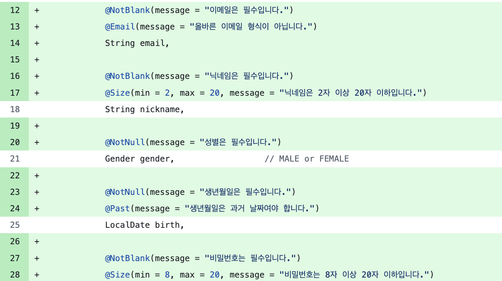

# 핵심 키워드 정리

## 클라우드 컴퓨팅이란?

**정의**
인터넷을 통해 서버, 스토리지, DB, 소프트웨어 등 컴퓨팅 자원을 원격으로 빌려 쓰는 기술. 직접 서버를 구매/운영하는 온프레미스 방식의 높은 초기 비용과 확장성 문제를 해결하기 위해 등장.

**서비스 모델 3가지**

| 모델 | 제공 범위 | 예시 |
|------|----------|------|
| IaaS (Infrastructure as a Service) | 가상 서버, 네트워크, 스토리지 | AWS EC2, GCP Compute Engine |
| PaaS (Platform as a Service) | 런타임 + 미들웨어 + OS | AWS Elastic Beanstalk, Google App Engine |
| SaaS (Software as a Service) | 완성된 소프트웨어 | Gmail, Notion, Slack |

**장점**
- 초기 인프라 비용 없이 사용한 만큼만 비용 지불
- 트래픽 증가 시 즉시 스케일 업/다운 가능
- 데이터 백업, 보안, 서버 유지보수를 CSP(클라우드 서비스 제공자)가 대신 처리

**단점**
- 인터넷이 끊기면 서비스 불가
- 장기적으로 직접 운영보다 비용이 높을 수 있음
- 데이터가 외부 서버에 저장되므로 민감 데이터 규정 준수 필요

---

## AWS? GCP?

**AWS (Amazon Web Services)**
- 클라우드 시장 점유율 1위 
- EC2(서버), S3(스토리지), RDS(DB), Lambda(서버리스) 등 서비스 종류가 압도적으로 많음
- 국내외 레퍼런스가 가장 많아 정보 찾기 쉬움
- 단점: UI가 다소 복잡하고 러닝커브가 있음

**GCP (Google Cloud Platform)**
- 시장 점유율 3위 
- BigQuery, Vertex AI 등 데이터 분석과 머신러닝에 강점
- Google 내부 인프라(검색, YouTube)를 그대로 사용하는 수준의 네트워크 성능
- Artifact Registry에서 컨테이너 이미지 및 패키지(Maven, npm) 통합 관리 가능
- 단점: AWS에 비해 서비스 수가 적고, 커뮤니티 자료가 적음

**주요 서비스 비교**

| 용도 | AWS | GCP |
|------|-----|-----|
| 가상 서버 | EC2 | Compute Engine |
| 오브젝트 스토리지 | S3 | Cloud Storage |
| 관계형 DB | RDS | Cloud SQL |
| 서버리스 함수 | Lambda | Cloud Functions |
| 컨테이너 오케스트레이션 | EKS | GKE |
| 메시지 큐 | SQS + SNS | Pub/Sub |

## 환경변수 처리 방법과 왜 환경변수로 민감 정보를 가려야 하는가?

**왜 민감 정보를 환경변수로 가려야 하는가?**
- `application.yml`에 DB 비밀번호, JWT Secret Key, API Key를 직접 쓰면 GitHub에 올리는 순간 전 세계에 공개됨
- git history에 한 번 올라가면 삭제해도 기록이 남아 있어 이미 유출된 것으로 봐야 함
- 해킹, 크롤러 봇이 GitHub에서 AWS Key 같은 값을 자동 탐색해 악용하는 사례 다수 발생

**처리 방법**

1. **`application.yml`에서 `${}`로 환경변수 참조**
```yaml
spring:
  datasource:
    password: ${DB_PASSWORD}
jwt:
  secret: ${JWT_SECRET}
```

2. **로컬 개발 시** — IntelliJ Run Configuration에서 환경변수 설정
```
DB_PASSWORD=mypassword
JWT_SECRET=mysecret
```

3. **서버 배포 시** — OS 환경변수로 주입
```bash
export DB_PASSWORD=mypassword
java -jar app.jar
```
또는 `.env` 파일 작성 후 `source env.sh` (단, 이 파일도 `.gitignore`에 추가 필수)

4. **CI/CD 사용 시** — GitHub Actions Secrets 또는 Jenkins Credentials로 관리
```yaml
# GitHub Actions
env:
  DB_PASSWORD: ${{ secrets.DB_PASSWORD }}
```

5. **AWS 배포 시** — AWS Secrets Manager로 중앙 관리

**`.gitignore` 필수 등록**
```
application-prod.yml
.env
env.sh
```

---

## yml 환경 분리 방법

**왜 환경을 분리하는가?**
- 로컬에서는 로컬 DB, 개발 서버에서는 개발 DB, 운영 서버에서는 운영 DB를 써야 함
- 운영 서버에 `show-sql: true` 같은 디버그 설정이 켜져 있으면 성능 저하

**방법 1 — 파일 분리 (권장)**
```
resources/
├── application.yml          # 공통 설정 + 기본 프로필 지정
├── application-local.yml    # 로컬 전용 설정
├── application-dev.yml      # 개발 서버 전용 설정
└── application-prod.yml     # 운영 서버 전용 설정
```

```yaml
# application.yml
spring:
  profiles:
    default: local   # 기본값을 local로
```

```yaml
# application-prod.yml
spring:
  config:
    activate:
      on-profile: prod
  datasource:
    url: jdbc:mysql://prod-db:3306/mydb
```

**방법 2 — 단일 파일에서 `---` 구분자로 분리**
```yaml
# application.yml
spring:
  jpa:
    properties.hibernate.format_sql: true  # 공통 설정

---
spring:
  config:
    activate:
      on-profile: local
  datasource:
    url: jdbc:mysql://localhost:3306/mydb

---
spring:
  config:
    activate:
      on-profile: prod
  datasource:
    url: jdbc:mysql://prod-db:3306/mydb
```

**프로필 활성화 방법**
```bash
# jar 실행 시
java -jar -Dspring.profiles.active=prod app.jar

# IntelliJ VM options
-Dspring.profiles.active=local
```

---

## Docker와 .jar vs Docker 이미지

**`.jar`로 배포**
- `./gradlew build`로 `.jar` 파일 생성 후 서버에 올려 `java -jar app.jar`로 실행
- **전제 조건**: 서버에 JDK/JRE가 설치되어 있어야 함
- 서버 OS, Java 버전 설정을 직접 맞춰야 함 → 서버마다 환경이 다를 경우 "내 로컬에선 되는데" 문제 발생

**Docker 이미지로 배포**
- `.jar` + JDK + OS + 설정을 하나의 이미지에 패키징
- 이미지를 실행하면 어디서든 동일한 환경으로 동작하는 컨테이너가 생성됨
- Docker가 설치된 곳이라면 어느 서버, 어느 OS든 동일하게 실행 가능

**관계 정리**
```
Dockerfile (빌드 명세서)
    → docker build → Docker 이미지 (템플릿, 변경 불가)
                        → docker run → 컨테이너 (실행 중인 인스턴스)
```

**Spring Boot jar를 Docker 이미지로 만드는 Dockerfile 예시**
```dockerfile
FROM openjdk:17-jre-slim
WORKDIR /app
COPY build/libs/app.jar app.jar
ENTRYPOINT ["java", "-jar", "/app/app.jar"]
EXPOSE 8080
```

```bash
docker build -t my-app .        # 이미지 빌드
docker run -p 8080:8080 my-app  # 컨테이너 실행
```

**비교 요약**

| | .jar 직접 배포 | Docker 이미지 배포 |
|--|--------------|-----------------|
| 환경 의존성 | 서버에 JDK 필요 | Docker만 있으면 됨 |
| 환경 일관성 | 서버마다 다를 수 있음 | 어디서든 동일 |
| 배포 복잡도 | 단순 | Dockerfile 작성 필요 |
| 스케일 아웃 | 수동 | Kubernetes 등으로 쉽게 확장 |
| 실무 사용 | 소규모 단순 배포 | 대부분의 현대 배포 환경 |


# 미션

제 코드에서는 DTO에 @NotBlank만 달았는데, @Size(min=8, max=20), @Past, @NotNull 같은 세부 조건까지 챙긴 게 인상적이었습니다. 
특히 각 어노테이션에 한국어 message를 전부 달아놔서 프론트엔드가 에러 메시지를 그대로 사용자에게 보여줄 수 있는 게 좋았습니다.