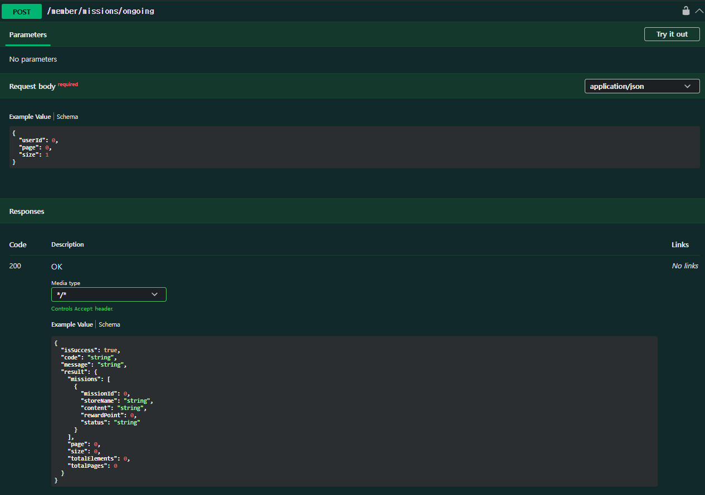
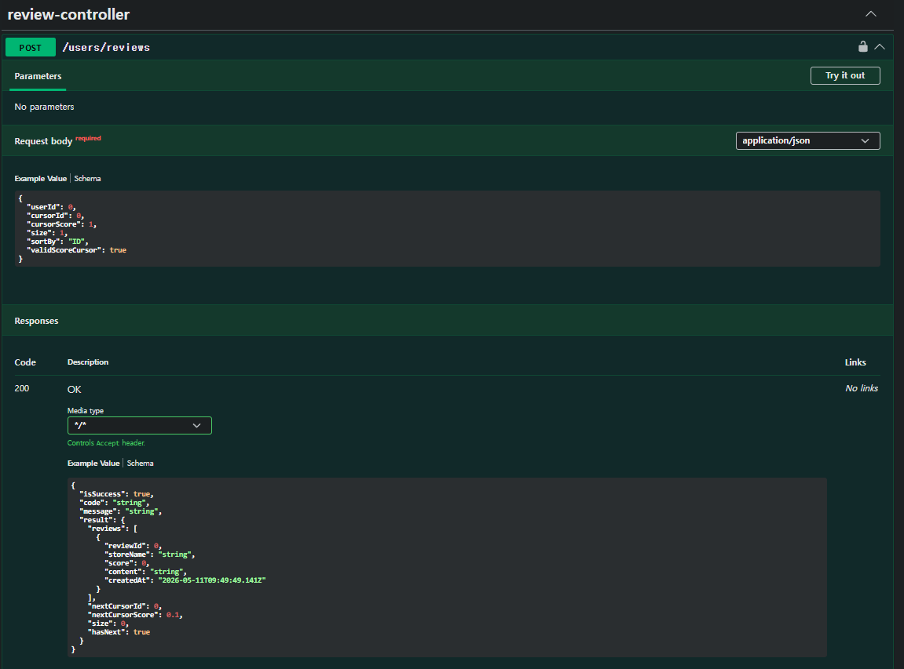

# Chapter07_API 설계 심화 - 페이징
## 학습 후기
## 핵심 키워드 정리

### Page와 Slice

Spring Data JPA에서 대량의 데이터를 나누어 조회할 때 사용하는 반환 타입입니다.

### 개념 및 특징

- **Page:** 전체 데이터 개수를 포함하는 페이징 결과입니다. `totalCount`와 `totalPages` 정보를 제공합니다.
- **Slice:** 전체 개수를 확인하지 않고 다음 페이지가 있는지만 확인합니다. 내부적으로 `limit + 1`을 조회하여 "다음" 버튼의 활성화 여부를 결정합니다.

**장단점**

| **구분** | **Page** | **Slice** |
| --- | --- | --- |
| **장점** | 전체 페이지 수, 전체 데이터 수를 알 수 있어 사용자 인터페이스(UI) 구성이 용이함. | 추가적인 `count` 쿼리가 발생하지 않아 성능상 유리함. |
| **단점** | 데이터 양이 많아질수록 `count` 쿼리 비용이 커져 성능 저하의 원인이 됨. | 전체 데이터 개수나 마지막 페이지 여부를 알 수 없음. |


### Java stream API

컬렉션 데이터를 선언적으로 처리하기 위한 기능입니다.

### 개념 및 특징

- **선언적 처리:** '어떻게(How)'가 아닌 '무엇을(What)' 할 것인지에 집중하여 코드를 작성합니다.
- **파이프라인 구조:** 생성 -> 중간 연산(filter, map 등) -> 최종 연산(collect, sum 등)의 구조를 가집니다.
- **지연 연산(Lazy Evaluation):** 최종 연산이 호출되기 전까지 중간 연산은 수행되지 않습니다.

### 장단점

- **장점:** 코드가 간결해지고 가독성이 좋아집니다. 병렬 처리를 `parallelStream()`으로 쉽게 구현할 수 있습니다.
- **단점:** 단순 반복문(for-loop)에 비해 오버헤드가 발생할 수 있으며, 디버깅이 상대적으로 어렵습니다.

### 유의할 점

- **재사용 불가:** 스트림은 일회용입니다. 한 번 최종 연산을 수행하면 닫히므로 다시 사용할 수 없습니다.
- **Side Effect 지양:** 스트림 외부의 상태를 변경하는 로직은 지양하고, 순수 함수형으로 작성해야 병렬 처리 시 안전합니다.
### 객체 그래프 탐색

JPA 환경에서 엔티티 간의 연관 관계를 따라가며 데이터에 접근하는 방식입니다.

### 개념 및 특징

- **정의:** `order.getMember().getName()`과 같이 연관된 객체를 참조를 통해 조회하는 것입니다.
- **범위:** 엔티티가 영속성 컨텍스트에 의해 관리될 때, 설계된 연관 관계 범위 내에서 자유롭게 탐색이 가능합니다.

### 장단점

- **장점:** 객체 지향적인 코드를 유지할 수 있으며, 복잡한 조인 쿼리를 직접 작성하지 않아도 됩니다.
- **단점:** 잘못 사용하면 **N+1 문제**(연관 관계를 조회할 때마다 추가 쿼리가 발생하는 현상)가 발생할 수 있습니다.

### 유의할 점

- **지연 로딩(Lazy Loading):** 실무에서는 가급적 모든 연관 관계를 지연 로딩으로 설정하여 불필요한 데이터 조회를 막아야 합니다.


### @Valid vs @validated

Spring 프레임워크에서 빈(Bean)의 유효성을 검증할 때 사용하는 어노테이션입니다.

### 개념 및 특징

- **@Valid:** JSR-303/JSR-384 자바 표준 스펙(Bean Validation)에 포함된 어노테이션입니다. 주로 컨트롤러 메서드 파라미터에서 사용됩니다.
- **@Validated:** Spring에서 제공하는 독자적인 어노테이션입니다. `@Valid`의 기능을 포함하며, 추가로 **검증 그룹(Group)** 기능을 지원합니다.

차이점 및 특징

| **구분** | **@Valid** | **@Validated** |
| --- | --- | --- |
| **출처** | Java 표준 (JSR) | Spring Framework |
| **그룹화** | 지원 안 함 | **그룹 검증 가능** (특정 상황에만 검증 적용) |
| **사용 위치** | 아규먼트 리졸버에 의해 동작 (컨트롤러) | AOP 기반으로 동작 (서비스 레이어 등 어디서나) |

### 유의할 점

- **계층 구조 검증:** 객체 내부의 리스트나 중첩된 객체를 검증하려면, 해당 필드에 반드시 `@Valid`를 붙여야 합니다. `@Validated`는 중첩 검증을 직접 수행하지 않습니다.
- **예외 처리:** `@Valid`는 `MethodArgumentNotValidException`을 던지고, `@Validated`는 `ConstraintViolationException`을 던지는 경우가 많으므로 예외 처리기(Exception Handler) 설정 시 주의가 필요합니다.


## 미션

### 내가 진행중인 미션 조회하기 (오프셋 기반 페이지네이션으로 응답하기, 사용자 ID는 Request Body에서 받기 하드코딩 X)

### 수정 전

- 기존 API는 `GET /member/{userid}/missions` 형태였다.
- 사용자 ID를 URL Path Variable로 받았다.
- 진행중/완료 상태는 `status` Query Parameter로 필터링했다.

### 수정 후

- `POST /member/missions/ongoing` API를 추가했다.
- 사용자 ID를 Request Body에서 받도록 구현했다.
- 하드코딩 없이 요청 Body의 `userId` 값을 사용한다.
- 진행중 미션만 조회하도록 `Status.CHALLENGING`으로 고정 조회한다.
- 오프셋 기반 페이지네이션을 사용한다.

### Request Body 예시

```json
{
  "userId": 1,
  "page": 0,
  "size": 10
}
```

### 주요 변경 파일
- MissionController.java
- MissionService.java
- MissionReqDto.java

### 내가 생성한 리뷰들 조회하기 (커서 기반 페이지네이션으로 응답하기, 사진 부분 제외, ID 순, 별점 순 모두 구현하기)

### 수정 전

- 리뷰 생성 API만 존재했다.
- 내가 작성한 리뷰 목록을 조회하는 API는 없었다.
- 리뷰 Repository에 커서 기반 조회 쿼리가 없었다.

### 수정 후

- `POST /users/reviews` API를 추가했다.
- 사용자 ID를 Request Body에서 받는다.
- 커서 기반 페이지네이션으로 응답한다.
- 사진 관련 필드는 응답 DTO에 포함하지 않았다.
- ID 순 조회와 별점 순 조회를 모두 구현했다.

### Request Body 예시: ID 순

```json
{
  "userId": 1,
  "cursorId": null,
  "size": 10,
  "sortBy": "ID"
}
```

### Request Body 예시: 별점 순

```json
{
  "userId": 1,
  "cursorId": null,
  "cursorScore": null,
  "size": 10,
  "sortBy": "SCORE"
}
```

### 응답 구조

- `reviews`: 리뷰 목록
- `nextCursorId`: 다음 요청에 사용할 마지막 리뷰 ID
- `nextCursorScore`: 별점 순 조회에서 다음 요청에 사용할 마지막 별점
- `size`: 현재 응답 개수
- `hasNext`: 다음 페이지 존재 여부

### 주요 변경 파일

- ReviewController.java
- ReviewService.java
- ReviewRepository.java
- ReviewConverter.java
- ReviewReqDto.java
- ReviewResDto.java

### Request Body가 있는 API에 검증 어노테이션 붙혀 검증하기(GeneralExceptionAdvice에 Exception 정의해야함, 아무 API 상관 X)

### 수정 전

- Request Body가 있는 API에 `@Valid`가 붙어 있지 않았다.
- DTO 필드에 검증 어노테이션이 없었다.
- 검증 실패 예외를 `GeneralExceptionAdvice`에서 별도로 처리하지 않았다.

### 수정 후

- Request Body를 사용하는 모든 API에 `@Valid`를 추가했다.
- DTO 필드에 검증 어노테이션을 추가했다.
- `GeneralExceptionAdvice`에 `MethodArgumentNotValidException` 처리 로직을 추가했다.
- 검증 실패 응답을 위한 `GeneralErrorCode.VALIDATION_FAILED`를 추가했다.
- Validation 의존성을 `build.gradle`에 추가했다.

### 적용한 주요 검증

- `@NotNull`
- `@NotBlank`
- `@Min`
- `@Max`
- `@Email`
- `@AssertTrue`

### 주요 변경 파일


- GeneralErrorCode.java
- GeneralExceptionAdvice.java
- MemberController.java
- MemberReqDto.java
- MissionController.java
- MissionReqDto.java
- ReviewController.java
- ReviewReqDto.java

## 이 외 변경사항
## 4. 리뷰 생성 로직 수정

### 수정 전

- `ReviewService`의 리뷰 생성 코드에서 `.member(member)`가 깨진 주석에 묻혀 실제 Builder 호출로 동작하지 않는 문제가 있었다.
- 이 상태에서는 `Review.member_id`가 정상 저장되지 않아 리뷰 생성 시 문제가 발생할 수 있었다.

### 수정 후

- `.member(member)`를 정상 Builder 호출로 복구했다.
- 리뷰 생성 시 작성자 회원 정보가 `Review`에 저장된다.

### 주요 변경 파일
- ReviewService.java
