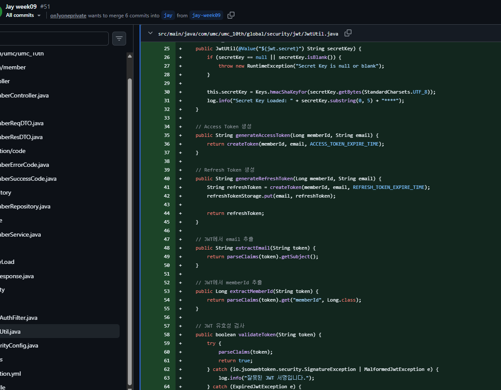
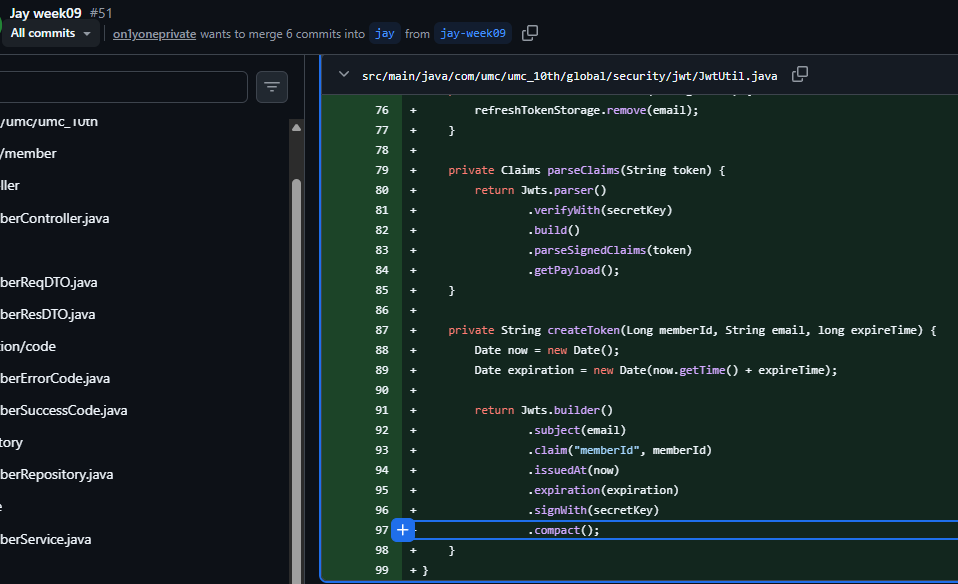
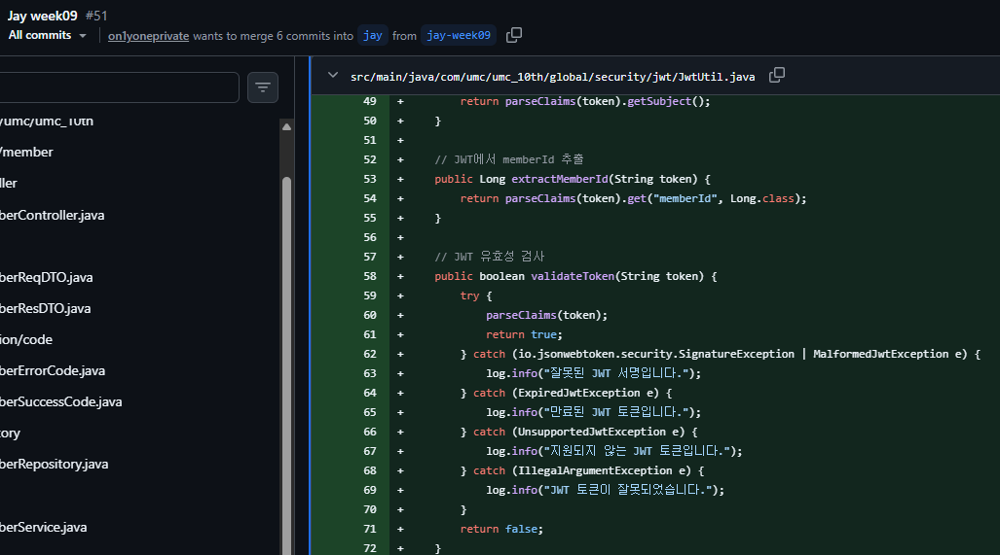

# Chapter10_프로젝트 배포하기 - AWS
## 학습 후기

## 핵심 키워드

### 클라우드 컴퓨팅이란?
인터넷(클라우드)을 통해 서버, 스토리지, 데이터베이스, 네트워킹, 소프트웨어 등의 컴퓨팅 자원을 필요할 때마다 원격으로 빌려 쓰고, 사용한 만큼만 비용을 지불하는 서비스 모델입니다.

**분류 및 장단점**

- IaaS (Infrastructure as a Service): 가상 서버, 가상 네트워크 등 순수 인프라만 제공 (예: AWS EC2)

- PaaS (Platform as a Service): 개발에 필요한 플랫폼과 런타임까지 제공 (예: Heroku, AWS Elastic Beanstalk)

- SaaS (Software as a Service): 완성된 소프트웨어를 웹으로 이용 (예: Google Drive, Slack)

**장점**
- 초기 인프라 구축 비용(서버실, 하드웨어 구매)이 들지 않고, 트래픽 급증 시 유연하게 자원을 늘릴 수 있습니다(Scalability).

- 하드웨어 장애 대응 및 관리를 클라우드 공급업체가 담당하므로 비즈니스 로직에만 집중할 수 있습니다.

**단점**

- 자원 관리를 소홀히 하면 예상을 뛰어넘는 '비용 폭탄'을 맞을 수 있습니다.

- 클라우드 공급업체의 대규모 장애(예: AWS 리전 장애)가 발생하면 서비스가 완전히 중단될 수 있으며, 제어권이 공급업체에 있습니다.

### AWS? GCP?
전 세계 클라우드 시장을 선도하는 대표적인 두 공급업체(CSP)입니다.

|비교 항목|AWS (Amazon Web Services)|GCP (Google Cloud Platform)|
|---|---|---|
|시장 지위|글로벌 1위, 가장 압도적인 점유율 및 커뮤니티 크기|3위권, 데이터 및 AI 분야에서 강력한 추격|
|핵심 강점|서비스 종류가 매우 다양하고 안정성이 검증됨|데이터 분석(BigQuery), 인공지능/ML, 쿠버네티스(GKE)|
|네트워킹/구조|리전(Region) 중심의 다소 복잡한 VPC 설계 필요|전 세계 단일 글로벌 네트워크 기반, VPC 설계가 직관적|

**장단점 및 선택 기준**

- **AWS를 선택하는 이유:** 대다수 기업이 사용하므로 참고할 레퍼런스와 트러블슈팅 자료가 방대합니다. 엔터프라이즈급 안정성이 필요할 때 표준적인 선택입니다. 다만, 서비스가 너무 많아 콘솔 UI가 복잡하고 학습 곡선이 높습니다.

- **GCP를 선택하는 이유:** 데이터 웨어하우스(BigQuery)의 성능이 압도적이며, 쿠버네티스의 고향답게 인프라 컨테이너화(GKE)가 가장 잘 되어 있습니다. 인스턴스 시작 속도가 AWS보다 빠르고 가격 정책이 상대적으로 단순합니다.

### 환경변수 처리 방법과 왜 환경변수로 민감 정보를 가려야 하는가?
**왜 환경변수로 민감 정보를 가려야 하는가?**
- 데이터베이스 비밀번호, API Secret Key, JWT 서명 키 같은 민감 정보가 소스코드에 하드코딩되어 GitHub 등 공개 저장소에 유출되는 사고는 보안 사고의 가장 흔한 원인입니다. 악성 봇들이 GitHub을 실시간으로 스캔하며 결제 가능한 API Key를 탈취해 수천만 원의 비용을 발생시키기도 합니다.

- 따라서 소스코드는 '동작 로직'만 담고, 환경에 따라 변하는 '데이터(민감 정보)'는 외부에서 주입하는 환경변수(Environment Variable) 방식으로 격리해야 합니다.

**환경변수 처리 방법**
- **로컬 개발 환경:** 프로젝트 루트에 .env 파일을 만들고 키-값 쌍으로 저장합니다. (예: DB_PASSWORD=secret123)

- **★가장 중요★** .gitignore 설정: 소스코드가 Git에 올라갈 때 .env 파일이 절대 포함되지 않도록 .gitignore 파일에 반드시 등록해야 합니다.

- **운영 환경:** 서버 자체의 OS 환경변수로 등록하거나, Docker 실행 시 -e 옵션으로 주익, 혹은 AWS Parameter Store / Secrets Manager 같은 전문 보안 서비스를 연동해 주입합니다.

### yml 환경 분리 방법
애플리케이션을 개발할 때 로컬(local), 테스트(test), 운영(prod) 환경은 사용하는 DB 주소나 포트가 다릅니다. 이를 하나의 파일에 뒤섞지 않고 분리하는 것이 정석입니다.

**한 파일 내에서 프로파일을 나누거나 가독성을 위해 멀티 문서 구조를 사용합니다.**
```
# application.yml (기본 설정 및 활성화할 환경 지정)
spring:
profiles:
active: local # 기본값을 local로 설정

---
# 로컬 개발 환경
spring:
config:
activate:
on-profile: local
server:
port: 8080
db:
url: jdbc:mysql://localhost:3606/dev_db

---
# 운영 환경
spring:
config:
activate:
on-profile: prod
server:
port: 80
db:
url: ${PROD_DB_URL} # 실제 민감 정보는 OS 환경변수에서 가져오도록 설정
```

### Docker와 .jar vs Docker 이미지
Spring Boot 애플리케이션을 배포할 때, 컴파일된 .jar 파일만 Docker에 올리는 것과 애플리케이션을 포함한 전용 Docker 이미지를 빌드하는 것의 차이입니다.

- **Docker 환경 위에 .jar 실행 (단순 인프라 공유):** 기본 Java 실행 환경(JRE)이 설치된 Docker 컨테이너를 띄워두고, 배포할 때마다 .jar 파일만 그 컨테이너 내부로 전송하여 java -jar app.jar를 실행하는 방식입니다.

- **애플리케이션 자체를 Docker 이미지로 빌드 (컨테이너화 표준):** 소스코드나 .jar 파일, 그리고 JRE 환경까지 통째로 구워 하나의 Custom Docker Image로 만듭니다. 배포할 때는 이 이미지를 컨테이너로 실행하기만 하면 됩니다.

**장단점 비교**

- **Docker + .jar 장점:** 빌드 프로세스가 단순하고, 이미지 용량을 매번 관리할 필요가 없어 초기 구축이 쉽습니다.

- **Docker + .jar 단점:** 컨테이너 내부의 Java 버전이나 환경 설정이 변경되면 수동으로 컨테이너를 관리해야 하므로, Docker의 핵심 장점인 '어디서나 동일한 실행 환경 보장'을 100% 누리지 못합니다.

- **Docker 이미지 장점:** 불변성(Immutability)이 보장됩니다. 내 로컬에서 돌아간 이미지는 운영 서버, 쿠버네티스, AWS ECS 등 어디에 올려도 완벽히 똑같이 작동합니다. 스케일 아웃(서버 늘리기)과 롤백이 매우 빠르고 쉽습니다.

- **Docker 이미지 단점:** 매번 배포할 때마다 새로운 이미지를 빌드하고 이미지 저장소(ECR, Docker Hub 등)에 업로드해야 하므로 CI/CD 파이프라인 구축 비용과 저장소 용량이 필요합니다.

**사용 시 유의할 점**
- 현대적인 클라우드 배포(DevOps) 환경에서는 "애플리케이션 자체를 Docker 이미지로 빌드"하는 것이 표준입니다.
- 이미지를 빌드할 때는 가벼운 Alpine Linux나 Distroless 이미지를 기반(Base Image)으로 사용하여 이미지 크기를 최소화하고 보안 취약점을 줄여야 합니다.


## 미션

### PR 리뷰 대신 지부 내 다른 챌린저의 워크북을 보고 해당 워크북에 담지 않은 내용, 내가 추가적으로 공부할 내용, 해당 챌린저가 잘한 부분 같은 걸 캡쳐 후 공부 계획, 좋았던 부분, 아니면 해당 워크북을 작성한 사람 칭찬을 적어주세요!!



- 해당 부분에 **RefreshToken** 개념이 들어가 있습니다. 현재 프로젝트 코드는 access token만 발급합니다. 그래서 토큰이 만료되면 다시 로그인해야 하는 구조에 가깝습니다. 해당 코드는 refresh token까지 고려하고 있어서 로그인 유지 / 토큰 재발급 / 로그아웃 시 토큰 폐기라는 더 실무적인 인증 흐름을 생각하고 있다고 생각합니다,



- memberId를 JWT에 직접 넣습니다. 현재 코드는 JWT에 email과 role만 넣고, 요청마다 email로 DB에서 회원을 다시 조회합니다. memberid를 토큰에 넣으면 사용자 식별이 빠르고 컨트롤러/서비스 단에서 id 기반으로 처리하기 쉽다는 장점이 있습니다.



- JWT 예외 처리가 더 자세합니다. 현재코드는 오류를 뭉뚱그려 처리합니다. 나쁜 코드는 아니지만 디버깅이나 로그 관점에서는 자세하게 구분하는 것이 좋다고 생각합니다,