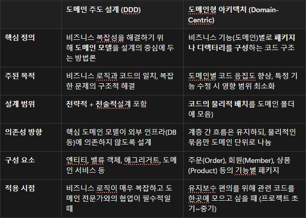
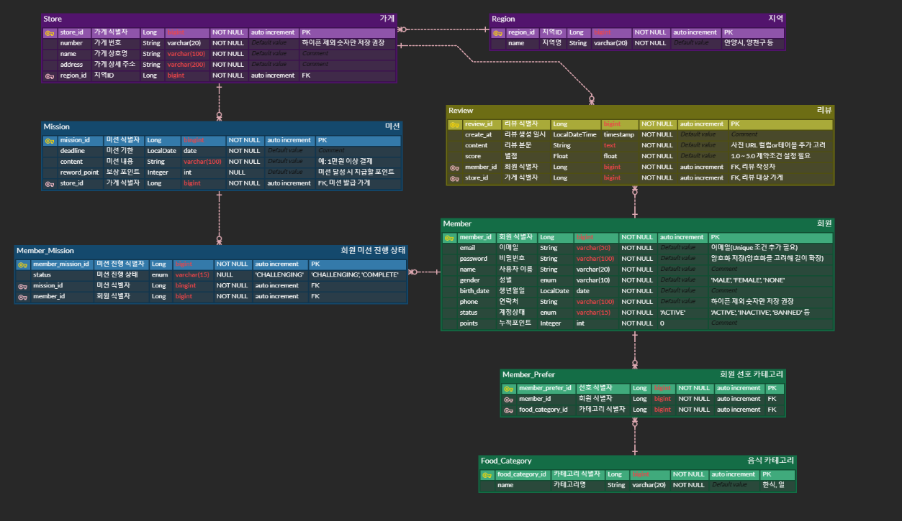
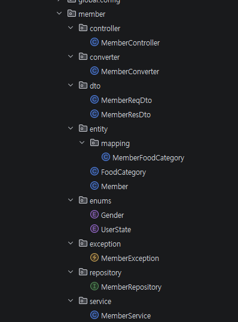
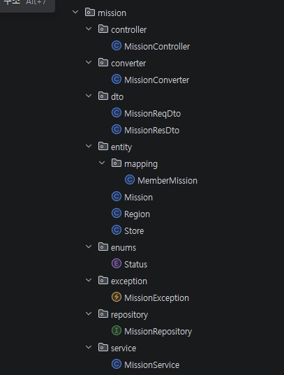
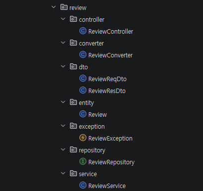

# Chapter04_프로젝트 세팅하기 - 아키텍처 구조, Swagger

## 1. 학습 후기
이번 주차를 학습하면서 앞으로 할 프로젝트에서 사용할 수 있는 여러가지 아키텍쳐 구조들과 api 문서화를 자동으로 해주는 Swagger를 학습하면서 단순히 개념만이 아닌 이것을 왜 사용하고 어떤식으로 활용이 가능한지 구체적인 사용방법을 학습한 것이 좋았습니다.
## 2. 핵심 키워드 정리
### 아키텍처 구조란?
소프트웨어 시스템에 대해 추론하는데 필요한 구조들의 집합이며, 그러한 구조와 시스템을 만드는 규율이다.

**아키텍처 구조를 설계하는 이유?**

유지보수의 측면이 크다.
아키텍처 구조를 설계하지 않고 통합적으로 코드를 작성했다면 세부적인 사항들을 손봐야 하는 상황이 발생할 때 불리해진다.

잘 짜여진 아키텍처 구조에서 낮은 의존성, 확장에 유리한, 유지보수하기 쉬운 코드를 작성하는 것이 중요하다.

**아키텍처 구조를 잘 설계했을 때 얻는 이득**

- 품질 향상: 유지 보수할 개발자가 이해하기 쉽다 -> 해당 프로젝트 구조를 이해하는데 시간 절약이 된다.
- 관심사 분리: A기능을 유지보수 -> A 기능이 있는 도메인만 유지보수(낮은 결합도)
- 예측 가능성: 정형화된 아키텍처 구조 사용 -> 제 삼자가 예측하기 쉬움 -> 유지보수 난이도 하락

**아키텍처 구조의 종류**

- 계층 기반 구조: 시스템 계층을 기준으로 파일을 분류한다.
- 도메인 기반 구조: 비즈니스 도메인을 기준으로 파일을 분류한다.
- 이 외에도 서버를 잘게 쪼개는 MSA나 이벤트 기반으로 설계하는 EDA도 있습니다.

**공통적인 아키텍쳐 구조 기본 원칙**

- 단일 책임 원칙: 각 객체, 계층은 하나의 역할만 부여
- 모듈화: 하나의 기능을 담은 코드를 모듈로 관리, 다른 객체나 계층에서 해당 기능이 필요한 경우 해당 모듈에게 지시
- 낮은 의존성: 한 부분의 변화가 다른 부분에 큰 영향을 미치지 않게 설계

### Swagger란?
- 개발한 API들의 목록을 확인하고 테스트 할 수 있는 프레임워크로
  API를 구현하면 그에 맞춰 자동으로 문서화 해주는 도구입니다.
### 도메인형 아키텍처란?
도메인형 아키텍처란 비즈니스 도메인을 기준으로 파일들을 분류하는 아키텍처이다.

장점: 각각의 도메인 별로 패키지 분리가 가능하여 계층형 구조보다 관리가 직관적이다,각각의 도메인들이 서로를 의존하는 코드가 없도록 설계하기 적합해 코드의 재활용성이 향상된다

단점: 프로젝트에 대한 이해도가 낮을 경우 전체적인 구조를 파악하기 어렵다

Ex) 쇼핑몰 시스템의 프로젝트 구조 예시

- member(회원 도메인)
    - MemberController: 회원 가입/로그인
    - MemberService: 비즈니스 로직
    - MemberRepository: DB 접근
    - Member: 도메인 객체
    - 기타
- order(주문 도메인)
    - OrderController: 주문 생성/취소
    - OrderService: 주문 로직
    - OrderRepository: DB 접근
    - Order: 도메인 객체
    - 기타
- product(상품 도메인)
    - ProductController
    - ProductService
    - ProductRepository
    - Product
    - 기타
### DDD vs 도메인형 아키텍처
DDD는 도메인 주도 설계이며 도메인 패턴을 중심에 놓고 설계하는 방식을 말합니다.
즉, 비즈니스 요구사항을 도메인 모델로 표현하고, 이를 통해 도메인의 책인과 역할을 명확하게 하는 것입니다.

DDD에서는 코드가 비즈니스 로직과 도메인을 직접 표현하기 때문에 별도의 문서 없이도 코드만으로 시스템의 설계와 동작을 이해할 수 있게 됩니다.

DDD vs 도메인형 아키텍처

### 왜 DTO를 사용하는가?
계층 간, 혹은 프로세스 간에 데이터를 전달하기 위해 사용하는 순수한 객체입니다.

**DTO의 핵심 특징 및 목적**

- **계층 간 데이터 전송**: 뷰 레이어(컨트롤러)와 도메인 레이어(서비스) 간 데이터를 주고받는 바구니 역할.
- **로직 없는 순수 객체**: 비즈니스 로직을 포함하지 않고, 데이터와 getter/setter만 가짐.
- **유지보수성 향상**: DB 테이블 구조(Entity)가 변경되어도 API 명세(DTO)는 유지할 수 있어 화면에 미치는 영향을 최소화함.
- **데이터 은닉**: DB의 민감한 정보(비밀번호 등)가 화면으로 노출되는 것을 방지.

DTO를 사용하는 이유

- **데이터 캡슐화:** 도메인 모델(Entity)을 직접 노출하지 않고 노출하고 싶은 데이터만 노출하여 보안 향상
- **API 유연성:** 뷰 레이어(UI) 변경 시 도메인 모델에 영향을 주지 않고 DTO만 수정.
- **성능 향상:** 여러 번의 데이터 요청을 하나의 DTO로 묶어 전송함으로써 원격 호출 횟수를 줄임.
### 컨버터는 왜 사용하는가?
Converter는 **HTTP 요청의 문자열 파라미터를 숫자, 객체, 날짜 등 자바의 다양한 타입으로 자동 변환하기 위해 사용**합니다.

**Spring Converter 사용 이유**

- **웹 요청 데이터 변환:** HTTP 요청 파라미터(요청 파라미터, 쿼리 스트링)는 기본적으로 모두 문자열(String)로 처리되는데, 이를 숫자, Boolean, 객체 등 원하는 타입으로 자동 변환해야 합니다.
- **코드 중복 제거:** 데이터 타입 변환 로직을 컨트롤러마다 구현하지 않고, 범용적인 컨버터로 공통화하여 재사용할 수 있습니다.
- **유연한 데이터 바인딩:** URL 경로 변수(@PathVariable)나 요청 파라미터(@RequestParam)를 객체(DTO) 타입으로 직접 매핑할 때, 사용자 정의 타입으로 변환하는 데 효율적입니다.
- **타입 안전성 및 예외 처리:** 타입 불일치 시 자동으로 예외를 발생 시키거나 바인딩 오류를 처리하여 애플리케이션의 안정성을 높입니다.
## 3.  미션
### ERD

### 내가 설계한 아키텍쳐 구조
#### 도메인을 큰 틀로 구분 
- 사용자(Member, MemberFoodCategory, FoodCategory)
- 미션(Mission, MemberMission, Store, Region) *미션을 다른 도메인으로 구분할 수 있으나 가게마다 미션이 존재하고 미션을 다른 도메인으로 만들어도 추후에 확장성측면에서 불필요하다는 생각해서 미션 도메인에 속하게 설계
- 리뷰(Review) *추후에 사진이나 부가 기능의 추가 가능성이 있어 다른 도메인으로 구분

## 4.  워크북의 내용을 제외한 추가 정보 학습의 경우 md파일에 추가 작성합니다.
### MSA의 정의
MSA는 소프트웨어를 작고 독립적으로 배포 가능한 서비스들의 집합으로 구성하는 아키텍처 스타일입니다. 
각 서비스는

- 특정 비즈니스 기능을 담당
- 독립적으로 개발, 배포, 확장 가능
- 자체 데이터 저장소 보유
- API를 통해 다른 서비스와 통신

### MSA의 핵심 원칙과 특징
1. 서비스 자율성 (Service Autonomy)
2. 비즈니스 중심 설계 (Business Capability)
3. 분산 데이터 관리 (Decentralized Data Management)
4. 장애 격리 (Failure Isolation)
5. API를 통한 통신

### MSA 도입 시 고려사항
- 데이터 일관성 문제
- 운영 복잡성

### MSA의 장단점

#### 장점

- 독립적인 배포와 확장
- 기술 스택 다양성
- 장애 격리
- 팀 자율성 

#### 단점

- 분산 시스템 복잡성
- 네트워크 통신 오버헤드
- 데이터 일관성 문제
- 운영 복잡도 증가
## EDA(Event-Driven Architecture)란?

EDA는 시스템의 상태 변화(이벤트)를 중심으로 설계된 아키텍처 패턴입니다. 이벤트의 생성, 감지, 소비를 통해 느슨하게 결합된 시스템을 구축합니다.

### 이벤트의 종류

1. 도메인 이벤트
2. 시스템 이벤트
3. 통합 이벤트

### EDA의 구성 요소와 패턴
#### 핵심 구성 요소
- **이벤트 생성** ->
**이벤트 라우팅** ->
**이벤트 처리**

#### 주요 패턴
1. Pub/Sub (Publish-Subscribe)
2. Event Streaming
3. Event Sourcing

### EDA의 장단점
#### 장점

- 느슨한 결합
- 확장성과 유연성
- 실시간 처리
- 복원력

#### 단점

- 이벤트 순서 보장 어려움
- 디버깅 복잡성
- 이벤트 스키마 관리
- 최종 일관성

## MSA와 EDA의 결합

### 시너지 효과
- 느슨한 결합
- 확장성
- 복원력
- 유연성

## 언제 사용해야 하는가?

### MSA가 적합한 경우
적합
- 대규모 개발 조직
- 빈번한 기능 변경
- 서비스별 다른 확장 요구사항
- 다양한 기술 스택 필요

부적합
- 소규모 팀/프로젝트
- 단순한 CRUD 애플리케이션
- 빠른 프로토타이핑
- 강한 트랜잭션 일관성 필요

### EDA가 적합한 경우
적합
- 실시간 데이터 처리
- 여러 시스템 간 통합
- 이벤트 기반 워크플로우
- 높은 확장성 요구

부적합
- 단순한 요청-응답 패턴
- 강한 일관성 요구
- 이벤트 순서가 중요한 경우
- 팀의 EDA 경험 부족