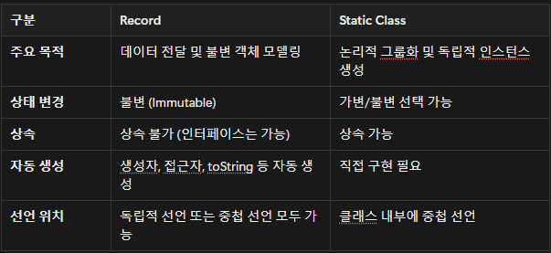
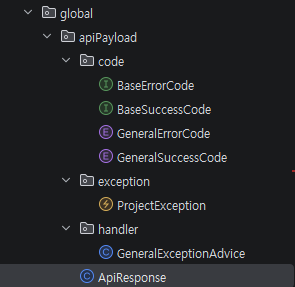
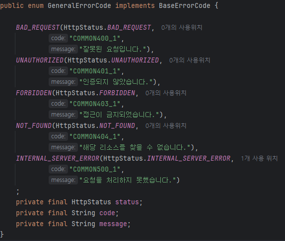
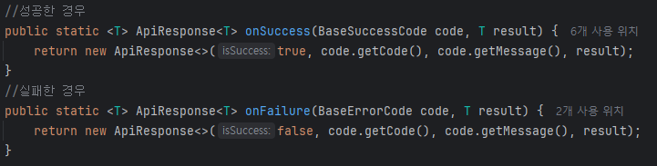

# Chapter05_프로젝트 세팅하기 - API 응답 통일, 에러 핸들러

# 이슈 내용

아래 6개의 과제를 수행하시면 됩니다.
많은 과제이지만 이전 과제를 리뷰하면서 여러분의 열정이라면 충분하다고 생각합니다!

## 1. 학습 후기

- 스프링 프로젝트 구현을 본격적으로 시작하면서 다시 복습하였는데 학습내용을 이해하고 나니 내가 전에 했었던 것이 많이 잘못되어있는 구조였다는 것을 알았고 앞으로 학습하면서 제대로된 구조로 구현하는 연습이 필요할 것 같다고 생각했습니다. 
- 구현하면서 여러 어노테이션들을 사용하는데 기능이 유사하거나 비슷한 어노테이션들이 있어서 어느것을 선택해야 하는지 헷갈렸던 부분들이 있어서 많이 자료들을 찾아본 것 같습니다.
## 2. 핵심 키워드 정리

### 빌더패턴이란?
객체의 생성 과정과 표현 방법을 분리하여 동일한 생성 절차에서 서로 다른 표현 결과를 만들 수 있게 하는 패턴입니다.

다음과 같은 문제를 해결하기 위해 사용합니다.

- 생성자 인자로 너무 많은 인자가 넘겨지는 경우 어떠한 인자가 어떠한 값을 나타내는지 확인하기 힘든 경우
- 어떠한 인스턴스의 경우에는 특정 인자만으로 생성해야 하는 경우
- 특정 인자에 해당하는 값을 null로 전달하는 경우

Lombok을 사용하지 않고 생성할 수 있지만 주로 LomBok을 사용해서 생성하는 경우가 많기 때문에 Lombok을 사용하여 생성하는 방법에 대해 설명합니다.

- **@AllArgsConstructor(access = AccessLevel.PRIVATE)**
   - @Builder 어노테이션을 선언하면 전체 인자를 갖는 생성자를 자동으로 만듭니다.
   - @AllArgsConstructor는 전체 인자를 갖는 생성자를 만드는데, 접근자를 private으로 만들어서 외부에서 접근할 수 없도록 만듭니다.
- **@Builder**
   - 위에서 설명한 듯이 Builder 패턴을 자동으로 생성해주는데, builderMethodName에 들어간 이름으로 빌더 메소드를 생성해줍니다.
- **클래스 내부 builder 메소드**
   - 필수로 들어가야 할 필드들을 검증하기 위해 만들어졌습니다.
   - 꼭 name이 아니더라도 해당 클래스를 객체로 생성할 때 필수적인 필드가 있다면 활용할 수 있습니다.
   - PK를 보통 지정합니다.

### **Builder 패턴의 장점**

1. **필요한 데이터만 설정할 수 있음.**
   1. 테스트용 객체를 생성 시 용이하고, 필요한 값만 작성할 수 있도록 해줘서불필요한 코드의 양을 줄이는 장점이 있습니다.
      ```
      Hero hero = Hero.builder("아이언맨")
      .profession(Profession.MAGE, "Riobard")
      .hairColor(HairColor.BLACK)
      .weapon(Weapon.DAGGER)
      .build();
      ```
2. **유연성을 확보할 수 있음.**
   1. 새로운 변수가 추가되는 상황이 와도 기존의 코드에 영향을 주지 않을 수 있습니다.
3. **가독성을 높일 수 있음.**
   1. 매개 변수가 많아져 가독성이 떨어지는 현상을 방지 할 수 있습니다.

      빌더 적용 전
      ```
      Hero hero = new Hero("아이언맨",Profession.MAGE, "Riobard","Paris flight 
      ticket",HairColor.BLACK,"1235-5345",Weapon.DAGGER)`
      ```
      빌더 적용
      ```
      Hero hero = Hero.builder("아이언맨")
      .profession(Profession.MAGE, "Riobard")
      .hairType("Paris flight ticket")
      .hairColor(HairColor.BLACK)
      .armor("1235-5345")
      .weapon(Weapon.DAGGER)
      .build();
      ```
4. **불변성을 확보할 수 있음.**
   1. 기존의 수정자 패턴(Setter)는 불필요하게 확장 가능성이 열려 있습니다.
      Open-Closed 법칙에 위배되고, 불필요한 코드 리딩 등을 유발합니다. 그렇기 때문에 클래스 변수를 final로 선언하고 객체의 생성은 빌더에 맡기는 것이 좋습니다.

      ```
      @NoArgsConstructor
      @AllArgsConstructor
      @Getter
      @Setter
      @Builder
      @ToString(exclude = "User")
      public static final class User
      {
           @Setter(AccessLevel.NONE)
           @Builder.Default
           @NotNull
           private String userkey;
            @NotNull
            private String name;
            @Setter(AccessLevel.NONE)
            private String number;

      }
      ```
### record vs static class

Record

순수하게 데이터를 담기 위한 객체(Data Carrier)를 정의합니다.

- **특징**
   - **불변성**: 모든 필드가 자동으로 `private final`로 선언됩니다.
   - **자동 생성**: 생성자, `equals()`, `hashCode()`, `toString()` 메서드를 컴파일러가 자동으로 생성해주어 코드가 매우 간결합니다.
   - **제약**: 다른 클래스를 상속받을 수 없으며, 인스턴스 변수를 추가로 선언할 수 없습니다.

**Static Class**

외부 클래스와 논리적으로 연결되어 있지만, 외부 클래스의 인스턴스 없이 독립적으로 객체를 생성하고 싶을 때 사용합니다.

- **특징**
   - **독립성**: 외부 클래스의 인스턴스 멤버에 직접 접근할 수 없으며, 독립적인 라이프사이클을 가집니다.
   - **메모리 효율**: 비정적 중첩 클래스(Inner Class)와 달리 외부 클래스에 대한 참조를 유지하지 않아 메모리 누수 위험이 적습니다.
   - **유연성**: 일반 클래스처럼 가변(Mutable) 필드를 가질 수 있고 상속도 가능합니다.


### 제네릭이란?
데이터형식에 의존하지 않고, 하나의 값이 여러 다른 데이터 타입들을 가질 수 있도록 하는 방법입니다.

네릭은 클래스와 인터페이스, 그리고 메소드를 정의할 때 타입(type)을 파라미터(parameter)로 사용할 수 있도록 하며,
타입 파라미터는 코드 작성 시 구체적인 타입으로 대체되어 다양한 코드를 생성하도록 해준다.


```
class FruitBox<T> {
     List<T> fruits = new ArrayList<>();
}
```

### **제네릭의 장점**

1. 제네릭을 사용하면 잘못된 타입이 들어올 수 있는 것을 컴파일 단계에서 방지할 수 있다.
2. 클래스 외부에서 타입을 지정해주기 때문에 따로 타입을 체크하고 변환해줄 필요가 없다. 즉, 관리하기가 편하다.
3. 비슷한 기능을 지원하는 경우 코드의 재사용성이 높아진다
### @RestControllerAdvice이란?
스프링에서 모든 `@RestController`에서 발생하는 예외를 전역적으로 처리하는 어노테이션입니다. `@ControllerAdvice`와 `@ResponseBody`가 합쳐진 형태로, 예외 발생 시 에러 메시지(객체)를 JSON으로 변환하여 일관된 형태의 API 응답을 클라이언트에게 전달합니다.

**주요 특징 및 기능**

- **전역 예외 처리**: 여러 컨트롤러에 흩어져 있는 중복된 `try-catch` 및 예외 처리 코드를 하나로 집중 관리할 수 있습니다.
- **AOP(Aspect Oriented Programming) 방식**: 특정 패키지나 특정 어노테이션이 붙은 컨트롤러에만 선택적으로 예외 처리 로직을 적용할 수 있습니다.
- **JSON 응답**: `@ResponseBody`가 내장되어 있어, 예외 상황에서 HTTP 상태 코드와 에러 객체를 JSON 바디에 담아 반환하는 RESTful API에 적합합니다.
- **`@ExceptionHandler`와 병용**: 주로 `@ExceptionHandler`와 함께 사용하여 특정 예외(Exception 클래스)를 잡아 구체적인 에러 내용을 응답합니다.

**@ControllerAdvice와의 차이점**


### Optional이란?
- Optional이란?

  null일 수도 있는 객체를 감싸는 클래스입니다.

  null을 다룰 때 발생하는 NullPointerException 을 방지하고 ‘값이 없을 수 있음’을 명시적으로 표현해 가독성과 안전성을 높입니다.

  간단한 예제 
- Optional 객체 생성
  ```
  Optional<T> result = TRepository.findById(TId);
  ```

  Optional 객체 접근

  ```
  if (result.isPresent()) {	
        return result.get();	
  } else {	
        return result.orElse(null);	
  }
  ```

  주요 메서드
- `isPresent()` : 값이 존재하면 참 아니면 거짓을 반환합니다.
- `isEmpty()` : 값이 없으면 참 아니면 거짓을 반환합니다.
- `get()`  : Optional에 감싸진 실제 객체를 반환합니다.(하지만 Optional에서 get을 사용하는 것은 지양하고 있습니다.)


  **get()사용을 지양하는 이유**

  get을 사용하기 위해서는 반드시 값의 존재 유무를 확인해야 합니다.
  하지만 이렇게 되면 기존의 if 를 사용하는 null 체크 방식과 다를 바 없어질 뿐더러
  Optional의 본래 목적인 NPM 회피의 의미가 사라지고 또 다른 예외가 생길 수 있는 환경이 됩니다.

  또 다른 이유로는 자바에서는 값이 없을 때 동작을 명시적으로 처리할 수 있는 메서드들이 존재합니다.
  orElse(기본값 반환) 나 orElseThrow(명시적 예외 발생) 와 같은 메서드들은 의도가 명확한 명령어들이기 때문에 코드의 가독성도 좋아지고 작성의 의도가 더 잘 보이기 때문입니다

  예시)
```
  public User getUserByIdWithThrow(Long id) {
     return userRepository.findById(id)
     .orElseThrow(() -> new RuntimeException("유저를 찾을 수 없습니다."));
  }
  ```
## 3.  미션
### 프로젝트 세팅을 마친 상태에서 응답 통일 객체, 에러 핸들링할 객체를 생성하기

    

- 응답 통일 객체와 에러 핸들링 객체는 워크북과 동일한 구조로 작성하였습니다.

- GeneralExceptionAdvice에서 사용하는 INTERNAL_SERVER_ERROR는 워크북에 따로 나와있지 않아 추가해주었습니다.

- ApiResponse에서 성공한 경우의 응답은 실패의 경우와 동일하게 제네릭 클래스를 사용하여 구현하였습니다.

### 2주차 미션으로 진행한 API 명세서를 기반으로 Controller, DTO 제작하기
- 2주차 api 명세서


- 각 도메인의 Dto는 static으로 구현하였고 비즈니스로직별 필요한 데이터 들을 묶어서 구현 
- 컨트롤러에서는 공통된 endpoint는 RequestMapping으로 분리 기능별로 필요한 Res,Req Dto를 주고 받음(추후 Service 구현 필요)
- 각 도메인 별로 성공, 실패 시 응답 코드는 공통 응답 작성시와 동일하게 BaseErrorCode, BaseSuccessCode를 상속받아 작성하였습니다.

