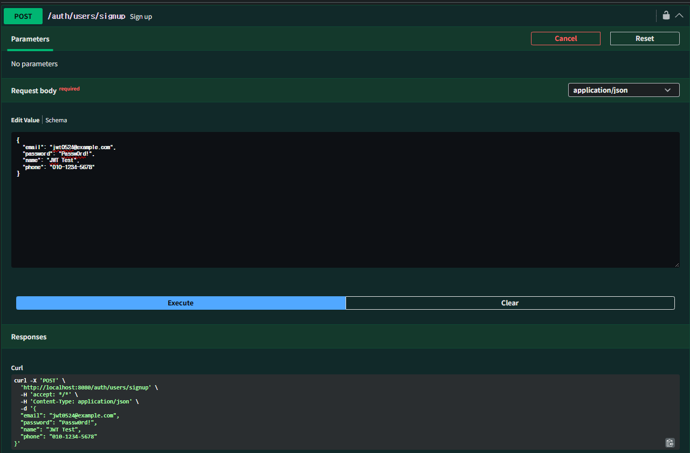
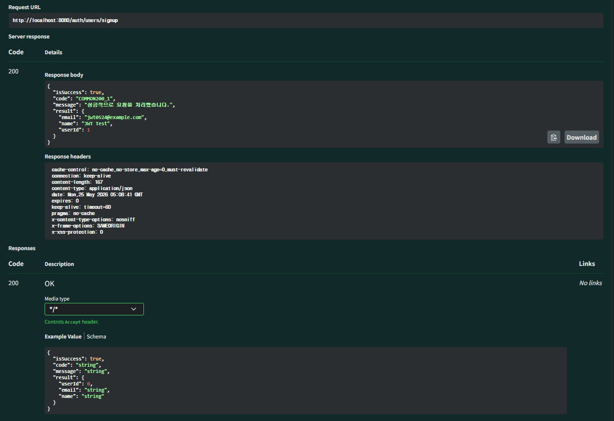
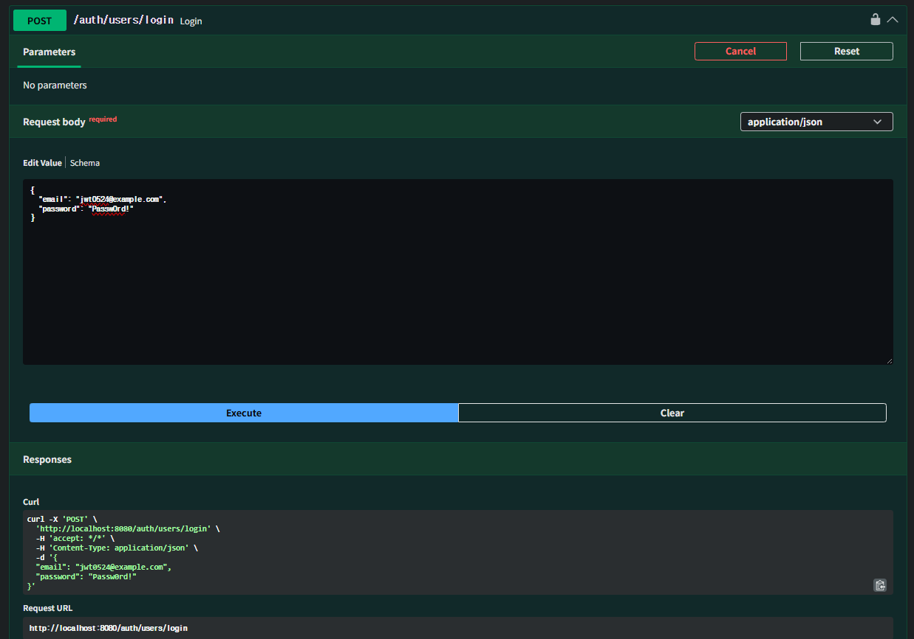
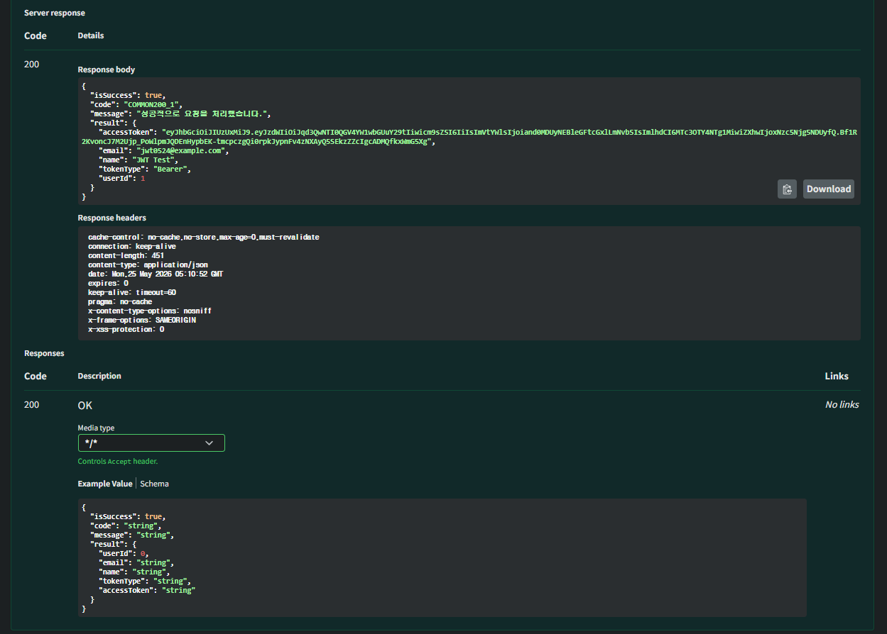
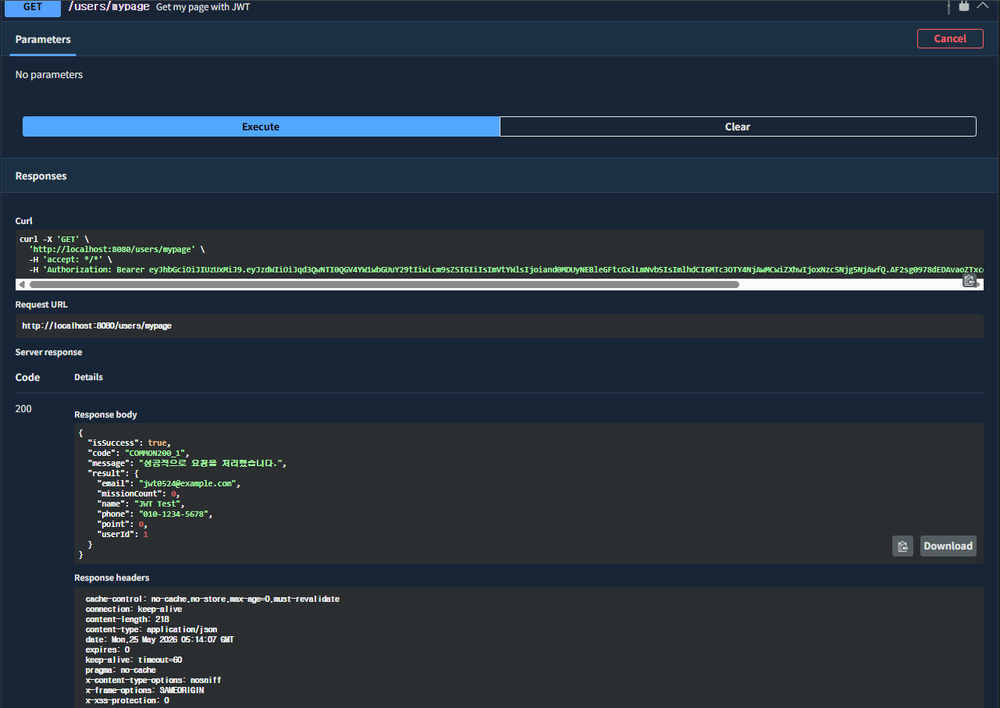
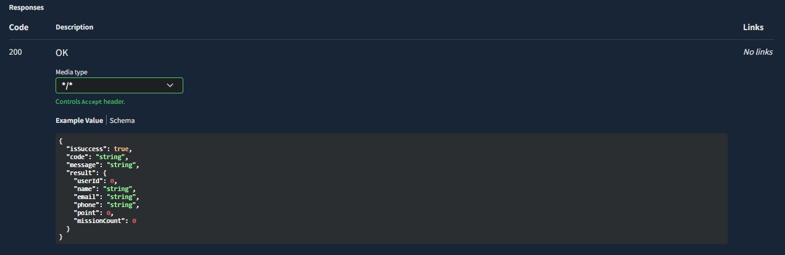

# Chapter09_Spring Security - JWT, OAuth

## 학습 후기
스프링하면서 처음으로 JWT토큰과 oAuth를 해보았는데 JWT 토큰은 비교적 이해가 잘된 것 같은데 OAuth가 오류가 많은지 2번째 미션을 하기 힘드네요

## 핵심 키워드 정리

### 세션과 토큰의 차이는?
**가장 큰 차이는 "인증 상태(로그인 정보)를 어디에 저장하느냐"입니다.**

|구분| 세션(Session)기반 인증| 토큰 (Token / JWT)기반 인증   |
|:---|:----------------|:------------------------|
|저장 위치| 서버 메모리 또는 DB    | "클라이언트 (브라우저, 앱 메모리 등)" |
|상태 유지|Stateful (서버가 상태를 기억함)|Stateless (서버가 상태를 보관하지 않음)|
|동작 방식|세션 ID를 쿠키에 담아 주고받음|검증 가능한 토큰(주로 JWT)을 주고받음|

**장단점**
- **세션 장점**: 제어권이 완전히 서버에 있습니다. 만약 특정 사용자의 세션을 강제로 만료시키거나(로그아웃, 중복 로그인 차단) 계정을 차단해야 할 때 서버에서 세션을 삭제하면 즉시 반영됩니다.

- **세션 단점**: 사용자가 많아질수록 서버 메모리 부담이 커집니다. 서버를 여러 대 두는 분산 환경(Scale-out)에서는 세션 동기화(Session Clustering)나 별도의 세션 서버(Redis 등)를 구축해야 하는 번거로움이 있습니다.

- **토큰 장점**: 서버가 상태를 저장하지 않으므로 확장성이 매우 뛰어납니다. 어떤 서버로 요청이 들어와도 토큰 자체만 검증(디코딩)하면 되기 때문에 마이크로서비스 아키텍처(MSA)나 서버리스 환경에 유용합니다.

- **토큰 단점**: 토큰은 한 번 발급되면 만료될 때까지 서버가 제어하기 어렵습니다. 토큰을 탈취당해도 서버가 이를 강제로 만료시키기 어렵고, 토큰 자체에 유저 정보가 담겨 있어 데이터가 커질수록 네트워크 부하가 늘어납니다.

**사용 시 유의할 점**
- 세션을 쓸 때: 서버가 다중화될 것을 대비해 처음부터 Redis 같은 인메모리 DB를 세션 저장소로 고려하는 것이 좋습니다.
- 토큰을 쓸 때: 토큰 자체는 암호화가 아닌 '인코딩'된 경우가 많으므로(JWT), 토큰 내부에 비밀번호나 주민번호 같은 민감한 개인정보를 절대 포함해서는 안 됩니다.

### 엑세스 토큰과 리프레시 토큰이란?

- **Access Token**: 리소스(데이터)에 접근하기 위한 실질적인 권한 증명서입니다. 수명이 매우 짧습니다 (보통 30분~2시간).

- **Refresh Token**: Access Token이 만료되었을 때, 새 Access Token을 발급받기 위한 "인증서 재발급 전용" 토큰입니다. 수명이 깁니다

**장단점**
- **장점**: Access Token을 탈취당하더라도 수명이 짧기 때문에 피해가 오래가지 않습니다. 사용자는 로그인 상태를 오래 유지하면서도(Refresh Token 덕분), 보안성은 높일 수 있습니다.

- **단점**: 구현이 복잡해집니다. 클라이언트는 Access Token 만료 시점을 체크해 재발급 요청을 보내는 로직을 짜야 하고, 서버도 두 종류의 토큰을 검증해야 합니다.

**사용 시 유의할 점**
- **저장 위치 보안**: Access Token은 탈취 위험을 최소화하기 위해 브라우저 메모리(변수)에 보관하는 것이 안전하며, Refresh Token은 CSRF(크로스 사이트 요청 위조)와 XSS(크로스 사이트 스크립팅) 공격을 방어하기 위해 반드시 httpOnly와 Secure 옵션이 켜진 쿠키에 저장해야 합니다.
- **RTR(Refresh Token Rotation) 도입 권장**: Refresh Token마저 탈취당하는 상황을 막기 위해, 새로운 Access Token을 발급할 때 Refresh Token도 매번 새로 갱신하여 기존 토큰을 무효화하는 RTR 기법을 적용하는 것이 안전합니다.

### OAuth 1.0과 OAuth 2.0의 차이는?
OAuth는 외부 서비스(구글, 카카오 등)의 권한을 안전하게 위임받기 위한 표준 프로토콜입니다.

|구분| OAuth 1.0|OAuth 2.0|
|---|-----------------------------------------|---|
|통신 보안| 암호화 서명(Signature) 필수 (HTTP에서도 작동)|"HTTPS(TLS) 필수 (서명 생략, 통신 자체를 암호화)"|
토큰 종류| "Request Token, Access Token 등 절차가 복잡함" | "Access Token, Refresh Token 등으로 단순화"    |
클라이언트 형태| 웹 브라우저 기반 환경 위주| "모바일 앱, 단말기, 서버 등 다양한 환경 지원"  |
역할 분리| 인증 서버와 데이터 서버의 구분이 모호함 | Authorization Server와 Resource Server 분리 |

**장단점**
- **OAuth 1.0 장점**: 통신 채널(HTTP)이 안전하지 않아도 디지털 서명 덕분에 데이터 변조를 막을 수 있어 프로토콜 자체는 매우 견고합니다.

- **OAuth 1.0 단점**: 암호화 서명을 생성하고 검증하는 로직이 너무 복잡해서 개발 생산성이 떨어지고 기기 확장성이 낮습니다.

- **OAuth 2.0 장점**: 디지털 서명 과정이 사라져 개발이 훨씬 쉽고 단순해졌습니다. 기능별로 다양한 승인 방식(Grant Type)을 제공하여 웹, 앱, 서버 간 통신 등 어디든 적용 가능합니다.

- **OAuth 2.0 단점**: 통신 암호화(HTTPS)에 보안을 전적으로 의존하기 때문에, HTTPS 설정이 잘못되거나 Access Token을 중간에 탈취당하면 보안이 쉽게 무너집니다.

**사용 시 유의할 점**
- **현재는 무조건 OAuth 2.0**: OAuth 1.0은 사실상 사장되었습니다. 새로 서비스를 구축한다면 반드시 OAuth 2.0(또는 이를 기반으로 한 OpenID Connect)을 사용해야 합니다.
- **보안 취약점 방어**: OAuth 2.0 구현 시 리다이렉트 URI(Redirect URI)를 서버에 명확히 화이트리스트로 등록해야 하며, 모바일이나 단말기 환경에서는 토큰 탈취를 방지하기 위해 PKCE(Proof Key for Code Exchange) 확장을 반드시 함께 적용해야 합니다.

## 미션
**JWT 토큰 방식의 회원가입, 로그인 구현하고 마이페이지도 워크북과 같은 형식으로 개선하기**
(Swagger에서 테스트하는 사진 & DB에 저장되는 사진 필수!)

### 회원가입

### DB 저장

### 로그인

### 마이페이지

**JWT + OAuth 구현하기**
(Spring OAuth-Client를 이용해도 되고 직접 호출하는 방식도 가능)

시간부족으로 완성하지 못했습니다...